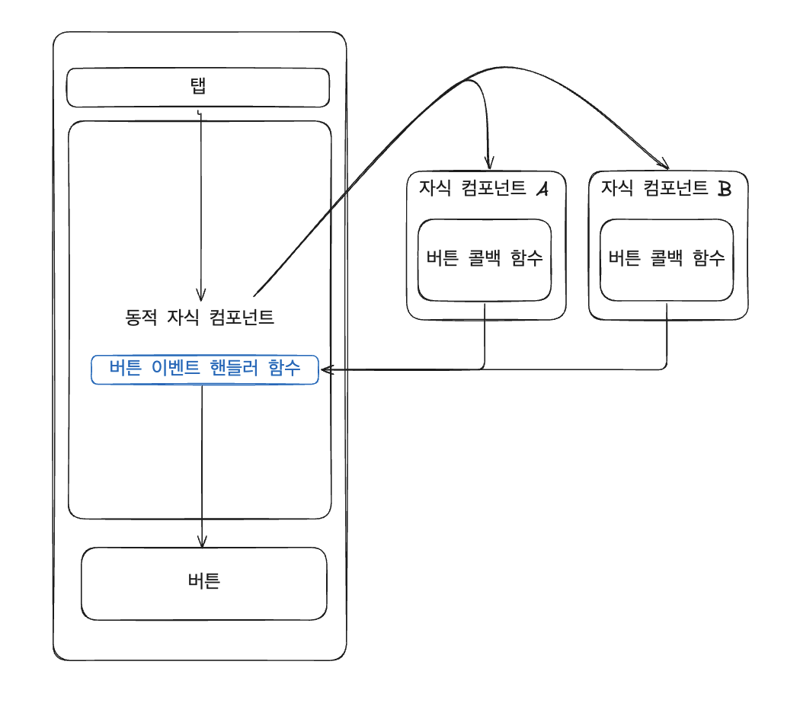

부모 컴포넌트에서 자식 컴포넌트 각각의 상태와 버튼에 대한 실행 함수가 다를 경우, 자식에서 버튼에 대한 실행 함수를 정의하여 실행되는 로직을 다르게 가져갈 수 있습니다.

1. 부모 컴포넌트에 `useRef`를 정의합니다. 자식 컴포넌트에서 실행할 함수 타입을 정의하고, 이를 자식 컴포넌트의 `ref` 속성에 매핑합니다. (자식 컴포넌트에서 실행할 함수를 정의해야 하므로, 자식 컴포넌트에서 실행할 함수 이름을 동일하게 하는 것이 좋습니다.)
2. 자식 컴포넌트에서는 `forwardRef`를 사용하여 컴포넌트를 감싸고, 부모가 `ref`를 전달할 수 있도록 합니다.
3. `useImperativeHandle` 훅을 이용하여 전달받은 ref를 매개변수로 전달하고, 사용할 함수를 다음 매개변수에서 콜백으로 정의합니다.

**Parent.tsx**

```jsx
import React, { useRef } from "react";
import Child from "./Child";

const Parent = () => {
    const childRef = useRef();

    const handleClick = () => {
        childRef.current.setText(); // 자식 컴포넌트의 함수 호출
    };

    return (
        <div>
            <button onClick={handleClick}>자식 컴포넌트 함수 호출 버튼</button>
            <Child ref={childRef} />
        </div>
    );
};

export default Parent;
```

**Child.tsx**

```jsx
import React, { forwardRef, useImperativeHandle, useState } from "react";

const Child = forwardRef((props, ref) => {
    const [text, setText] = useState("");

    useImperativeHandle(ref, () => ({
        setText: () => {
            setText("test"); // 상태 업데이트
        },
    }));

    return <input type="text" value={text} readOnly />;
});

export default Child;
```
이와 같이 구현하면 부모 컴포넌트에서 자식 컴포넌트의 상태를 효과적으로 제어할 수 있습니다.