# 하이젠(Hygen)이란?

> https://www.hygen.io/

하이젠은 자바스크립트 기반의 코드 제너레이팅 툴입니다. Node package인 하이젠은 CLI를 이용하여 미리 만들어둔 템플릿 코드를 원하는 위치에 생성 해주는 도구입니다.

- 간단하고 빠르며 확장 가능한 코드 생성기
- Redux, React, Express 등 다양한 환경에 사용 가능
- 파일 시스템에 직접 접근하여 파일 생성 및 수정 작업을 자동화
- 템플릿을 사용하여 여러 파일을 생성하고, 각 파일의 내용을 동적으로 생성
- 기존 파일에 코드를 삽입하는 기능 제공
- 특정 프레임워크나 라이브러리에 의존적이지 않음

## 어떻게 사용하는게 좋을까?

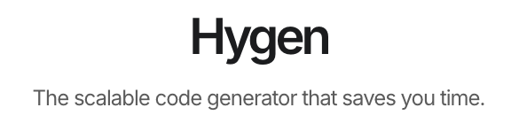

> The scalable code generator that saves you time.
> 확장 가능한 코드 생성기이며, 이것을 통해 시간을 절약할 수 있습니다.

궁극적인 목적은 **시간절약**을 하기 위함입니다.

저희에겐 `control + c` / `control + v`가 있지만 이런 행동은 이미 해당 코드에대해 잘 이해하고 있을경우 해당합니다. 시간이 지나면 다시 코드를 이해하기 위해 읽고 해석하는 시간과 피로가 발생합니다.

이러한 이유로 새로운 개발을 들어갈때나 새로운 컴포넌트를 생성하는 시점에서 하이젠을 이용한 CLI 템플릿 생성은 장기적으로 보았을때 도움이 될 수 있습니다.

# 하이젠 사용법

먼저 하이젠을 사용하기 위해 설치 작업이 필요합니다.

하이젠은 NPM을 통해 설치가 가능하며, MacOS 사용자라면 brew를 통해서도 설치가 가능합니다.

## 🔨 설치 방법

**npm**

```bash
$ npm i -g hygen
```

**brew**

```bash
$ brew tap jondot/tap
$ brew install hygen
```

## 🧑‍💻 사용 방법

1. 설정하고자 하는 프로젝트에서 `hygen init self` 명령어를 실행합니다.
   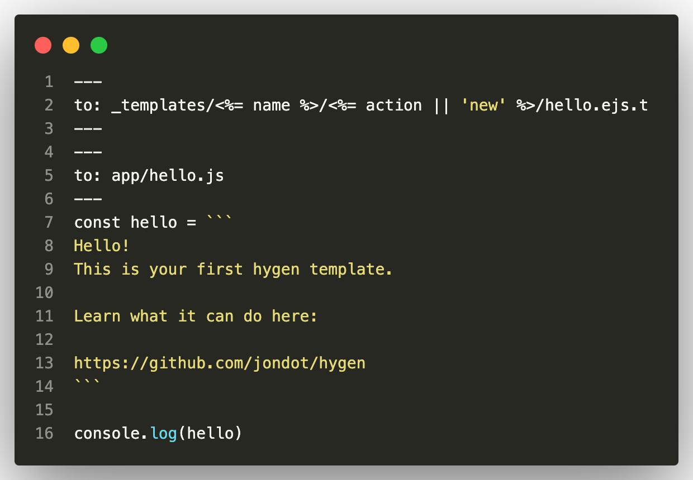

2. 명령어를 실행하게되면 root 경로에 `_templates` 폴더가 생성됩니다. 이 폴더를 통해 템플릿을 설정할 수 있습니다.

   ```text
   📦_templates
   ┣ 📂generator
   ┃ ┣ 📂help
   ┃ ┃ ┗ 📜index.ejs.t
   ┃ ┣ 📂new
   ┃ ┃ ┗ 📜hello.ejs.t
   ┃ ┗ 📂with-prompt
   ┃ ┃ ┣ 📜hello.ejs.t
   ┃ ┃ ┗ 📜prompt.ejs.t
   ┗ 📂init
   ┃ ┗ 📂repo
   ┃ ┃ ┗ 📜new-repo.ejs.t
   ```

3. 하이젠의 기본 명령어는 `$hygen [DIR_NAME] [action] [NAME]`으로 구성되어 있습니다.

4. `_templates/generator/new/hello.ejs.t` 코드 체크
   

   - 하이젠은 `---`를 이용해서 **frontmr section** 과 **body**로 나뉠수 있습니다.
   - to 속성을 이용하면 파일이 생성되는 경로를 설정할 수 있습니다.
   - `<%= [PARAM] %>` 문법은 ejs문법으로 CLI를 통해 전달됩니다.

5. `_templates/generator/new/hello.ejs.t` 코드 실행

   `$ hygen generator new --name awesome-generator` 명령어를 통해 실행할 수 있습니다. 실행하면 **\_templates/awesome-generator/new/hello.ejs.t** 파일이 생성됩니다.
   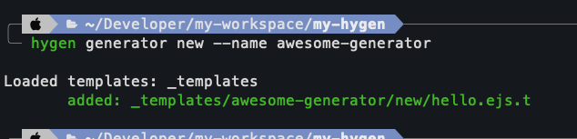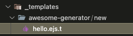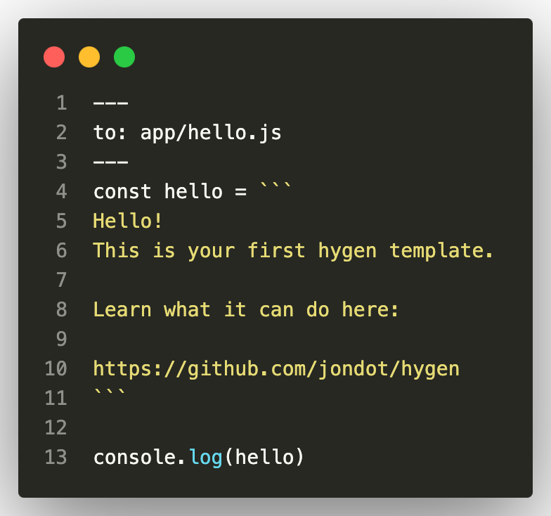 코드를 살펴보면 `---` 아래에있는 body 코드가 내부에 삽입된것을 확인 할 수 있습니다. 이 코드는 템플릿을 통해 새로운 템플릿을 만드는 코드입니다.
   따라서, `<%= name %>`에 awesome-generator 값이 들어가고, `<%= action %>`은 존재하지 않기때문에 'new' 값이 들어가서 해당 경로 파일이 생성됐습니다.

6. `_templates/awesome-generator/new/hello.ejs.t` 코드 실행

   `$ hygen awesome-generator new hello` 명령어를 통해 실행할 수 있습니다. 실행하면 **app/hello.js** 파일이 생성됩니다.

   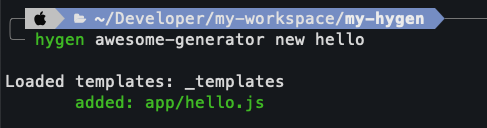

   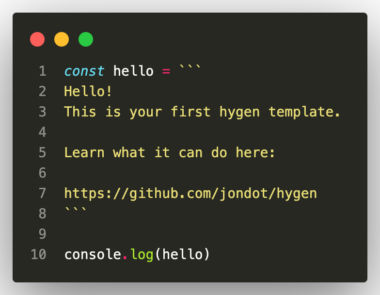
   to 속성에 정의된 경로에 body 코드가 들어가있는것을 확인 할 수 있습니다.

# 입력 상호작용 추가하기

CLI에서 유저 입력을 받아 컴포넌트를 생성하기 위해, Enquirer 라이브러리를 이용하면 상호작용 프롬프트를 구성할 수 있습니다.

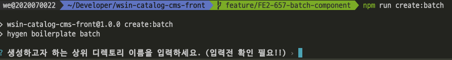

하이젠(Hygen)은 CLI 상호작용을 도와주는 enquirer를 내장하고 있기때문에 따로 설치할 필요없이 바로 사용할 수 있습니다.

이번엔 프롬프트를 구현해보겠습니다.

\_template 내의 generator 자리에 `prompt.js` 파일을 생성해줍니다.

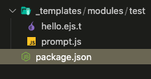

```javascript
// _template/modules/test/prompt.js

module.exports = {
  prompt: ({ prompter, args }) =>
    prompter
      .prompt({
        type: 'input',
        name: 'path1',
        message: 'Path1의 값을 입력해주세요.',
      })
      .then(({ path1 }) =>
        prompter
          .prompt({
            type: 'input',
            name: 'path2',
            message: 'Path2의 값을 입력해주세요.',
          })
          .then(({ path2 }) => {
            if (!path1) throw new Error('path1의 값이 비어있습니다. path1 의 값을 입력해주세요')
            if (!path2) throw new Error('path2의 값이 비어있습니다. path1 의 값을 입력해주세요')

            return {
              path1,
              path2,
              args,
            }
          })
      ),
}
```

Node.js 기반 모듈이므로 require 방식의 모듈 방식으로 코드를 구현합니다. 프롬프트 설정 자체도 `module.export`를 이용하여 내보냅니다. `prompter` 객체는 별도로 입력하지 않아도 자동으로 주입되며, `args`는 CLI 단계에서 입력받은 argument를 활용하고 싶을때 사용할 수 있습니다.

위 코드를 작성한뒤 실행해보겠습니다.

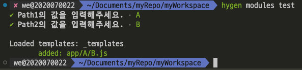

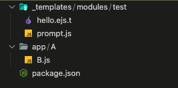

정상적으로 상호작용하는 모습을 볼 수 있습니다.

이 밖에도 옵션을 이용한 방법과 몇가지 내장 함수들을 지원하기도합니다.

### option 기반으로 입력

```javascript
prompter.select({
  type: 'input',
  name: 'category',
  message: '카테고리 컴포넌트의 카테고리를 선택하세요.',
  choices: ['animation', 'common', 'core', 'util'],
})
```

### 내장 함수들

```javascript
// example: <%= h.inflection.pluralize(name) %>

pluralize(str, plural)
singularize(str, singular)
inflect(str, count, singular, plural)
camelize(str, low_first_letter)
underscore(str, all_upper_case)
humanize(str, low_first_letter)
capitalize(str)
dasherize(str)
titleize(str)
demodulize(str)
tableize(str)
classify(str)
foreign_key(str, drop_id_ubar)
ordinalize(str)
transform(str, arr)
```

```javascript
// example: <%= h.changeCase.camel(name) %>

camel(str)
constant(str)
dot(str)
header(str)
isLower(str)
isUpper(str)
lower(str)
lcFirst(str)
no(str)
param(str)
pascal(str)
path(str)
sentence(str)
snake(str)
swap(str)
title(str)
upper(str)
```

# Frontmatter section 살펴보기

---

위에서 언급했듯이 frontmatter section에는 아래와 같은 속성들을 지원합니다.

| Property                                                              | Type         | Default   | Example                                |
| --------------------------------------------------------------------- | ------------ | --------- | -------------------------------------- |
| [`to:`](https://www.hygen.io/docs/templates#addition)                 | String (url) | undefined | my-project/readme.md                   |
| [`from:`](https://www.hygen.io/docs/templates#from--shared-templates) | String (url) | undefined | shared/docs/readme.md                  |
| [`force:`](https://www.hygen.io/docs/templates#addition)              | Boolean      | false     | true                                   |
| [`unless_exists:`](https://www.hygen.io/docs/templates#addition)      | Boolean      | false     | true                                   |
| [`inject:`](https://www.hygen.io/docs/templates#injection)            | Boolean      | false     | true                                   |
| [`after:`](https://www.hygen.io/docs/templates#injection)             | Regex        | undefined | devDependencies                        |
| [`skip_if:`](https://www.hygen.io/docs/templates#injection)           | Regex        | undefined | myPackage                              |
| [`sh:`](https://www.hygen.io/docs/templates#shell)                    | String       | undefined | echo: "Hello this is a shell command!" |

## 1. from

`from`은 외부 파일로부터 읽어들여 `body`를 채워줍니다. `incloude`와 비슷한 역할을 하지만 이때 `body template`은 무시합니다.

## 2. inject

`inject`는 말그래도 `template`을 주입시켜주는 속성입니다.

`inject`를 사용시에는 어디에 주입시킬것인지 조건을 넣어줘야합니다. 조건으로는 `after`, `before`, `prepend`, `append`, `at_line` 이 있습니다. 그리고 `skip_if`를 통해 주입을 skip할것인지아닌지 조건을 달수있습니다.

- `before` or `after` : 정규식을 이용해 조건에 맞는 라인을 찾고 이전라인 or 다음라인에 template 코드를 주입시킵니다.
- `prepend` or `append` : 정규식을 이용해 조건에 맞는 라인을 찾고 해당 코드의 이전 or 다음 에 붙여서 template 코드를 주입시킵니다.
- `at_line` : 원하는 라인에 template 코드를 주입시킵니다.

아래 코드로 한번더 설명하겠습니다.

### 예제코드 1

```javascript
// app/menu.js

export default menu = ['apple', 'banana', 'tomato']
```

위 메뉴에 새롭게 신규 메뉴(**melon**)를 개발하게되었습니다. 위 menu.js를 통해 화면에 메뉴를 노출된다고했을때, 새롭게 생성할 신규메뉴인 melon이 자동으로 주입되어야하는 상황입니다.

이때, 아래의 template을 이용해 코드를 주입할 수 있습니다.

```javascript
// _template/generator/new/injectMenu.ejs.t

---
to: app/menu.js
inject: true
after: menu
---

	"<%= menu %>",  // --menu melon
```

`$ hygen generator new —menu melon` 명령어를 실행하면 menu의 첫번째 인덱스로 코드가 주입됩니다.

> 💡 이때 프로젝트에 린트설정이 되어있다면 린트룰에 맞게 설정하는것이 작업에 다음번 작업에서 더 편합니다.

> 💡 `after` 속석은 정규식을통해 해당라인을 찾아내는데 가장 먼저 발견되는 텍스트에서 적용됩니다.

### 예제코드 2

```javascript
// app/menu2.js

export default menu = [
  {
    id: 'apple',
    children: [
      {
        id: 'apple2',
      },
    ],
  },
  {
    id: 'banana',
    children: [
      {
        id: 'banana2',
      },
    ],
  },
]
```

이번엔 신규 메뉴(apple3)를 개발해야하는 상황입니다. 이때는 apple.children에 코드를 주입해줘야합니다.

```javascript
// _template/generator/new/injectMenu2.ejs.t

---
to: app/menu2.js
inject: true
after: <%= menu %>..[^\[]*children  // --menu apple
---

			{
				id: "<%= name %>",  // --name apple3
			},
```

정규식을 이용해 코드를 작성한 후 `$ hygen generator new —menu apple — apple3` 명령어를 실행시켜주면 apple.children의 첫번째 인덱스에 코드가 주입됩니다.
