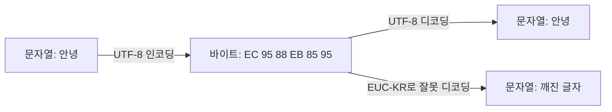
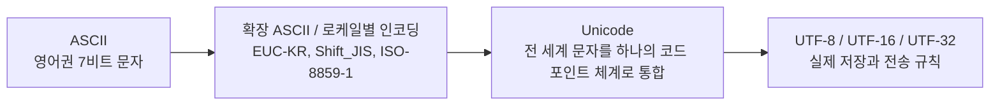
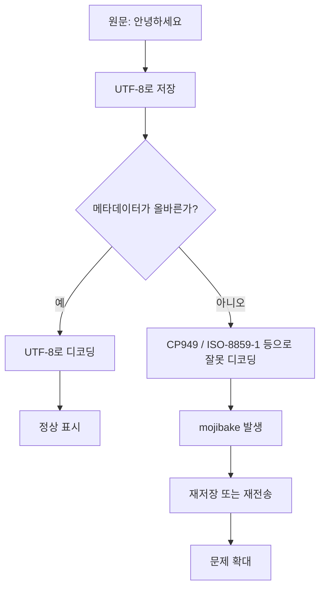

# 인코딩과 디코딩의 뜻

> 한줄 정의: **인코딩(encoding)**은 어떤 정보를 약속된 규칙에 따라 다른 표현으로 바꾸는 과정이고, **디코딩(decoding)**은 그 규칙을 사용해 원래 의미를 다시 복원하는 과정입니다.
> 컴퓨터에서는 문자, 바이너리 데이터, 이미지, 오디오, 비디오까지 거의 모든 정보가 이 원리 위에서 저장되고 전송됩니다.

## 목차

- [개요](#개요)
- [인코딩과 디코딩의 기본 개념](#인코딩과-디코딩의-기본-개념)
- [문자 인코딩의 역사와 발전](#문자-인코딩의-역사와-발전)
- [유니코드와 UTF 인코딩](#유니코드와-utf-인코딩)
- [데이터 인코딩](#데이터-인코딩)
- [인코딩 vs 암호화 vs 해싱](#인코딩-vs-암호화-vs-해싱)
- [글자 깨짐(Mojibake)](#글자-깨짐mojibake)
- [실전 예시](#실전-예시)
- [요약](#요약)

## 개요

컴퓨터는 결국 **0과 1의 비트열**만 다룰 수 있습니다.
사람이 사용하는 문자, 파일, 이미지, 소리도 컴퓨터 안에서는 모두 바이트 배열로 저장됩니다.

문제는 사람이 생각하는 정보와 컴퓨터가 처리하는 비트 사이에는 직접적인 연결이 없다는 점입니다.
`A`라는 글자와 `01000001`이라는 비트열이 연결되려면, 둘 사이에 **"이 바이트는 이 문자를 뜻한다"**라는 약속이 먼저 있어야 합니다.

이 약속을 실제 규칙으로 만든 것이 인코딩입니다.
반대로 저장된 바이트를 다시 읽어 원래 의미를 이해하는 과정이 디코딩입니다.

이 개념은 크게 두 축으로 나눠 이해하면 편합니다.
첫째는 **문자 인코딩**입니다.
사람이 읽는 글자를 바이트로 바꾸고 다시 복원하는 규칙입니다.

둘째는 **데이터 인코딩**입니다.
이미 존재하는 바이트 데이터를 특정 환경에서 안전하게 전달하기 쉬운 문자열로 바꾸는 규칙입니다.
Base64, URL Encoding, HTML Entity가 여기에 속합니다.

문자 인코딩과 데이터 인코딩은 둘 다 "인코딩"이라는 단어를 쓰지만 목적이 다릅니다.
문자 인코딩은 **문자를 저장하기 위한 규칙**이고, 데이터 인코딩은 **이미 있는 데이터를 운반하기 쉽게 바꾸는 규칙**에 가깝습니다.

현실에서는 두 개념이 자주 섞여 보입니다.
브라우저는 HTML 문서를 UTF-8로 해석해야 하고, URL의 쿼리 문자열은 퍼센트 인코딩으로 해석해야 하며, 어떤 API는 이미지 바이너리를 Base64 문자열로 실어 보내기도 합니다.

이 노트에서는 먼저 인코딩과 디코딩의 기본 원리를 정리합니다.
그다음 ASCII에서 Unicode, UTF-8로 이어지는 문자 인코딩의 역사와 구조를 살펴봅니다.
이후 Base64, URL Encoding, HTML Entity 같은 데이터 인코딩을 비교하고, 마지막으로 글자 깨짐인 **mojibake**가 왜 생기는지와 어떻게 해결하는지를 정리합니다.

## 인코딩과 디코딩의 기본 개념

인코딩은 **의미를 다른 표현으로 바꾸는 것**입니다.
디코딩은 **그 표현을 다시 의미로 되돌리는 것**입니다.

여기서 중요한 점은 변환 자체보다도 **같은 규칙을 공유해야 한다**는 사실입니다.
보내는 쪽이 UTF-8로 인코딩했는데 받는 쪽이 EUC-KR로 디코딩하면, 바이트는 그대로인데 해석만 달라져서 글자가 깨집니다.

가장 단순한 예를 보겠습니다.
ASCII 규칙에서는 `A`를 `65`라는 숫자로 대응시키고, 2진수로는 `01000001`로 표현합니다.
문자 `A`를 바이트 `0x41`로 바꾸는 것이 인코딩이고, 저장된 `0x41`를 다시 `A`로 읽는 것이 디코딩입니다.

중요한 사실은 바이트 자체에 "의미"가 들어 있는 것이 아니라는 점입니다.
의미는 언제나 **규칙을 아는 해석기**가 부여합니다.
그래서 인코딩은 데이터 그 자체가 아니라, 데이터를 읽는 **문맥과 계약**까지 포함한 개념입니다.



위 다이어그램에서 핵심은 바이트가 같아도 디코더가 다르면 결과가 달라진다는 점입니다.
인코딩과 디코딩은 보통 한 쌍으로 다뤄야 합니다.

인코딩은 문자에만 쓰이지 않습니다.
다음 표처럼 **문자**, **데이터**, **미디어**라는 서로 다른 맥락에서 사용됩니다.

| 맥락 | 무엇을 변환하는가 | 대표 예 | 주된 목적 |
|------|-------------------|--------|-----------|
| 문자 인코딩 | 문자 ↔ 바이트 | ASCII, EUC-KR, UTF-8, UTF-16 | 텍스트 저장과 전송 |
| 데이터 인코딩 | 바이트 ↔ 안전한 문자열 표현 | Base64, URL Encoding, HTML Entity | 전송 호환성, 특수문자 회피 |
| 미디어 인코딩 | 원본 신호 ↔ 압축된 데이터 | JPEG, PNG, MP3, AAC, H.264 | 저장 공간 절약, 스트리밍 효율 |

문자 인코딩에서는 사람이 읽는 텍스트가 출발점입니다.
반면 Base64 같은 데이터 인코딩에서는 원래 데이터가 이미 바이트 형태일 수 있습니다.
또 미디어 인코딩에서는 보통 압축까지 포함되기 때문에 "인코딩"이라는 말이 더 넓은 뜻으로 쓰입니다.

이 차이를 구분하지 않으면 용어가 금방 섞입니다.
예를 들어 "이미지를 인코딩했다"는 말은 PNG나 JPEG로 압축해서 저장했다는 뜻일 수 있고, "문자열을 인코딩했다"는 말은 UTF-8로 바꿨다는 뜻일 수 있습니다.

> **Q: 인코딩은 압축과 같은 개념인가?**
>
> 아닙니다.
> 인코딩은 **표현 방식을 바꾸는 것**이고, 압축은 **같은 정보를 더 적은 공간으로 저장하는 것**입니다.
> UTF-8은 문자 인코딩이고, ZIP은 압축 포맷입니다.
> JPEG나 MP3처럼 인코딩과 압축이 함께 일어나는 경우도 있지만, 두 개념은 동일하지 않습니다.

인코딩과 디코딩은 결국 **약속된 규칙을 송신자와 수신자가 공유하는 문제**입니다.
이 원칙은 문자 인코딩 역사, 웹 개발, 데이터베이스 설정, API 통신, 파일 저장 형식까지 전부 이어집니다.

## 문자 인코딩의 역사와 발전

문자 인코딩의 역사는 컴퓨터가 처음에는 영어권 환경에서 출발했다는 사실과 깊게 연결됩니다.
초기의 컴퓨터는 오늘날처럼 전 세계 문자를 한 번에 다루는 것을 목표로 하지 않았습니다.

결국 역사는 세 단계로 정리할 수 있습니다.
첫 번째는 **ASCII 중심의 단일 체계**입니다.
두 번째는 각 지역이 필요에 따라 만든 **로케일별 인코딩 체계**입니다.
세 번째는 전 세계 문자를 하나의 목록으로 통합한 **Unicode 체계**입니다.



### ASCII

ASCII는 **American Standard Code for Information Interchange**의 약자입니다.
초기 컴퓨터 시스템과 통신 장비에서 널리 쓰인 기본 문자 집합입니다.

ASCII는 7비트를 사용하므로 총 128개의 값을 표현할 수 있습니다.
즉, `0`부터 `127`까지의 숫자 각각에 문자나 제어 문자를 배정합니다.

여기에는 대문자 A-Z, 소문자 a-z, 숫자 0-9, 공백, 줄바꿈, 탭, 몇몇 기호가 포함됩니다.
오늘날에도 ASCII는 여전히 중요합니다.
왜냐하면 많은 최신 인코딩이 **ASCII와의 하위 호환성**을 유지하기 때문입니다.

예를 들어 다음은 ASCII의 일부입니다.

| 10진수 | 16진수 | 문자 | 의미 |
|--------|--------|------|------|
| 32 | `0x20` | 공백 | space |
| 48 | `0x30` | `0` | 숫자 0 |
| 65 | `0x41` | `A` | 대문자 A |
| 97 | `0x61` | `a` | 소문자 a |
| 10 | `0x0A` | LF | 줄바꿈 |

ASCII의 강점은 단순함입니다.
1바이트 중 실제로는 하위 7비트만 사용하면 되므로 구현이 매우 간단했습니다.

하지만 한계도 분명했습니다.
영어 중심 체계이기 때문에 한글, 한자, 일본어, 아랍어, 이모지 같은 문자를 담을 수 없습니다.
즉, ASCII는 **국제화 이전 시대의 문자 표준**이라고 볼 수 있습니다.

### 확장 ASCII / 로케일별 인코딩

ASCII의 한계를 해결하려는 첫 번째 시도는 1바이트 전체 256개 값을 활용하는 것이었습니다.
이렇게 만들어진 것이 흔히 말하는 **확장 ASCII** 계열입니다.

문제는 확장 ASCII가 하나의 통일된 표준이 아니었다는 점입니다.
유럽권에서는 `ISO-8859-1`, 윈도우에서는 `Windows-1252`, 한국에서는 `EUC-KR`, 일본에서는 `Shift_JIS`, 중국에서는 `GB2312` 같은 방식이 각자 발전했습니다.

이 시기의 핵심 특징은 **지역마다 별도 규칙을 만들었다**는 점입니다.
즉, 어떤 바이트 값이 어떤 문자를 의미하는지가 지역과 운영체제에 따라 달랐습니다.

예를 들어 1바이트 `0xE9`는 어떤 환경에서는 `é`로 읽히고, 다른 환경에서는 완전히 다른 의미를 갖기도 했습니다.
더 큰 문제는 한글이나 한자처럼 문자 수가 많은 언어는 1바이트만으로 부족해서 **2바이트 조합**을 쓰기 시작했다는 점입니다.

한국어 환경에서 자주 등장하는 `EUC-KR`은 대표적인 멀티바이트 인코딩입니다.
영문과 ASCII 구간은 그대로 쓰되, 한글은 2바이트 조합으로 표현합니다.
일본어의 `Shift_JIS`도 비슷하게 ASCII와 멀티바이트 구간이 섞여 있습니다.

이 방식은 당시 현실적인 해결책이었습니다.
하지만 다른 언어권과 데이터를 주고받을 때 호환성이 심각하게 떨어졌습니다.
같은 파일을 한국어 윈도우와 일본어 환경에서 열었을 때 전혀 다른 글자가 보일 수 있었던 이유가 여기에 있습니다.

정리하면 로케일별 인코딩 시대의 특징은 다음과 같습니다.

| 특징 | 설명 |
|------|------|
| 지역 최적화 | 특정 언어권에서는 사용하기 편함 |
| 상호 비호환성 | 다른 지역 인코딩과 충돌이 잦음 |
| 구현 복잡성 증가 | 1바이트와 2바이트 구간이 혼재 |
| 메타데이터 의존 | "이 파일은 무엇으로 저장되었는가" 정보가 중요 |

대표적인 문제는 파일을 열 때 인코딩 정보를 잃어버리면 복구가 어려웠다는 점입니다.
같은 바이트열도 여러 방식으로 해석될 수 있기 때문입니다.
이것이 나중에 글자 깨짐 문제의 핵심 원인이 됩니다.

> **Q: EUC-KR과 CP949는 어떤 관계인가?**
>
> `CP949`는 마이크로소프트가 윈도우 환경에서 사용한 한국어 코드 페이지로, 실무에서는 `MS949`라고도 부릅니다.
> 보통 **EUC-KR의 확장판**으로 이해하면 됩니다.
> 즉, EUC-KR이 다루지 못하는 일부 한글 음절과 기호를 더 포함하고 있습니다.
> 그래서 "윈도우에서 저장한 한글 문서"는 엄밀히 말해 EUC-KR이 아니라 CP949인 경우가 많습니다.
> 둘은 매우 가깝지만 완전히 동일한 규격은 아닙니다.

### Unicode의 등장

이런 혼란을 끝내기 위해 등장한 것이 **Unicode**입니다.
Unicode의 목표는 간단합니다.
**세상의 모든 문자에 고유한 번호를 부여하자**는 것입니다.

여기서 중요한 점은 Unicode가 곧바로 "저장 형식"을 뜻하지는 않는다는 사실입니다.
Unicode는 먼저 **문자 목록과 코드 포인트 체계**를 정의합니다.

코드 포인트(code point)는 각 문자에 부여된 번호입니다.
보통 `U+XXXX` 형식으로 씁니다.
예를 들어:

| 문자 | 코드 포인트 |
|------|-------------|
| `A` | `U+0041` |
| `가` | `U+AC00` |
| `한` | `U+D55C` |
| `😀` | `U+1F600` |

이 표에서 보듯 Unicode는 문자마다 하나의 추상적 번호를 정합니다.
하지만 이 번호를 메모리에 어떤 바이트로 저장할지는 아직 정하지 않았습니다.
그 역할을 맡는 것이 UTF-8, UTF-16, UTF-32 같은 **UTF 인코딩**입니다.

이 구분은 매우 중요합니다.
Unicode는 **문자의 추상적 식별자 체계**이고, UTF는 **그 식별자를 바이트로 옮기는 실제 규칙**입니다.

즉 다음처럼 구분하면 정확합니다.

- Unicode: 문자 집합과 코드 포인트 표
- UTF-8 / UTF-16 / UTF-32: Unicode 코드 포인트를 저장하는 방법

Unicode의 등장으로 "한국어용 문자 체계", "일본어용 문자 체계", "영어용 문자 체계"를 따로 유지할 필요가 줄어들었습니다.
이제는 같은 문자를 전 세계가 같은 코드 포인트로 공유하고, 실제 저장 방식만 선택하면 됩니다.

그 결과 국제화와 다국어 처리의 복잡도가 크게 낮아졌습니다.
웹 문서, 운영체제, 데이터베이스, 프로그래밍 언어가 하나의 공통 기반 위에서 동작할 수 있게 된 것입니다.

## 유니코드와 UTF 인코딩

앞에서 본 것처럼 Unicode는 문자 목록이고, UTF는 저장 규칙입니다.
실무에서는 Unicode와 UTF를 혼용해서 말하는 경우가 많지만, 엄밀하게는 분리해서 이해해야 합니다.

UTF는 **Unicode Transformation Format**의 약자입니다.
즉, Unicode 코드 포인트를 실제 바이트열로 변환하는 형식입니다.

가장 대표적인 세 가지는 UTF-8, UTF-16, UTF-32입니다.
세 방식은 모두 같은 Unicode 문자를 표현할 수 있지만, **바이트 길이**, **호환성**, **메모리 사용량**, **구현 편의성**이 다릅니다.

### UTF-8

UTF-8은 오늘날 가장 널리 쓰이는 문자 인코딩입니다.
가변 길이 인코딩이며, 한 문자를 1바이트에서 4바이트 사이로 표현합니다.

가장 큰 장점은 **ASCII와 완벽하게 호환**된다는 점입니다.
ASCII 구간인 `U+0000`부터 `U+007F`까지는 UTF-8에서도 정확히 같은 1바이트 값을 사용합니다.

즉 영어 알파벳, 숫자, 공백, 기본 기호는 ASCII 파일과 UTF-8 파일에서 바이트가 동일합니다.
이 호환성 덕분에 기존 인터넷 프로토콜과 텍스트 도구 위에서 UTF-8이 매우 유리했습니다.

UTF-8의 바이트 패턴은 다음과 같습니다.

| 코드 포인트 범위 | 바이트 수 | 비트 패턴 | 예 |
|------------------|-----------|-----------|----|
| `U+0000` ~ `U+007F` | 1바이트 | `0xxxxxxx` | 영문, 숫자 |
| `U+0080` ~ `U+07FF` | 2바이트 | `110xxxxx 10xxxxxx` | 일부 라틴 확장 문자 |
| `U+0800` ~ `U+FFFF` | 3바이트 | `1110xxxx 10xxxxxx 10xxxxxx` | 한글, 한자, BMP 다수 |
| `U+10000` ~ `U+10FFFF` | 4바이트 | `11110xxx 10xxxxxx 10xxxxxx 10xxxxxx` | 이모지, 일부 희귀 문자 |

앞바이트의 선행 비트가 총 바이트 수를 알려주고, 뒤따르는 바이트들은 `10`으로 시작합니다.
이 구조 덕분에 UTF-8은 바이트 스트림 안에서 경계를 비교적 쉽게 찾을 수 있습니다.

한글 음절 `가`를 예로 들어 보겠습니다.
Unicode 코드 포인트는 `U+AC00`입니다.

1. `U+AC00`을 2진수로 쓰면 `1010 1100 0000 0000`입니다.
2. `U+0800` 이상 `U+FFFF` 이하이므로 UTF-8에서는 3바이트가 필요합니다.
3. 3바이트 패턴은 `1110xxxx 10xxxxxx 10xxxxxx`입니다.
4. 16비트를 `1010 | 110000 | 000000`으로 나눠 넣습니다.
5. 결과는 `11101010 10110000 10000000`입니다.
6. 16진수로 쓰면 `EA B0 80`입니다.

즉 `가`의 UTF-8 바이트는 `0xEA 0xB0 0x80`입니다.

이렇게 보면 UTF-8은 단순히 "한글은 3바이트"라고 외우는 것보다, **비트 슬롯에 코드 포인트를 채워 넣는 규칙**으로 이해하는 편이 훨씬 정확합니다.

UTF-8의 장단점은 다음과 같습니다.

| 항목 | 설명 |
|------|------|
| 장점 1 | ASCII와 완전 호환 |
| 장점 2 | 웹, 파일, 네트워크 프로토콜에서 범용성 높음 |
| 장점 3 | 바이트 순서 문제가 없어 BOM이 필수 아님 |
| 단점 1 | 비영어권 텍스트는 2~4바이트로 길어질 수 있음 |
| 단점 2 | 문자 인덱싱이 고정 길이가 아니라 단순하지 않음 |

영문 위주의 문서에서는 UTF-8이 매우 효율적입니다.
한글이나 이모지가 많아도 실제 웹 환경에서는 장점이 더 큽니다.
그래서 오늘날 HTML, JSON, JavaScript 소스 파일, API 응답, 로그 파일 대부분이 UTF-8을 기본으로 채택합니다.

> **Q: 웹에서 UTF-8이 사실상 표준이 된 이유는?**
>
> ASCII와 하위 호환되면서도 전 세계 문자를 모두 표현할 수 있기 때문입니다.
> 기존 인터넷 인프라가 ASCII 중심으로 구축되어 있었기 때문에, UTF-8은 이를 깨지 않고 자연스럽게 확장할 수 있었습니다.
> 또한 바이트 순서 문제가 상대적으로 단순하고, 웹 서버, 브라우저, 프로그래밍 언어, JSON 생태계 전반이 UTF-8을 기본값으로 수렴하면서 사실상 표준이 되었습니다.

### UTF-16

UTF-16은 16비트 단위를 기반으로 하는 가변 길이 인코딩입니다.
기본 단위는 2바이트이며, 일부 문자는 4바이트를 사용합니다.

초기의 Unicode는 16비트면 충분하다고 생각했기 때문에 UTF-16 계열이 한동안 널리 사용되었습니다.
특히 BMP(Basic Multilingual Plane) 범위의 문자는 2바이트 하나로 표현할 수 있습니다.

예를 들어 `가(U+AC00)` 같은 한글 음절은 BMP에 있으므로 UTF-16에서 2바이트 하나로 표현됩니다.
반면 `😀(U+1F600)` 같은 문자는 BMP 밖에 있으므로 2바이트 두 개가 필요합니다.
이 두 개의 16비트 단위를 **서로게이트 페어(surrogate pair)**라고 부릅니다.

예를 들어 `U+1F600`은 UTF-16에서 대략 다음처럼 처리됩니다.

1. `0x10000`을 뺀 뒤 20비트 값을 만듭니다.
2. 상위 10비트는 high surrogate에 넣고, 하위 10비트는 low surrogate에 넣습니다.
3. 결과는 `0xD83D 0xDE00`입니다.

즉 메모리에는 2개의 코드 유닛이 저장됩니다.
이 때문에 UTF-16을 다룰 때는 "문자 수"와 "16비트 코드 유닛 수"를 구분해야 합니다.

자바스크립트 문자열이 대표적인 예입니다.
JavaScript는 문자열을 UTF-16 코드 유닛 시퀀스로 다루기 때문에, 이모지 하나가 `.length === 2`로 나오는 일이 발생합니다.

```js
console.log('A'.length);    // 1
console.log('가'.length);   // 1
console.log('😀'.length);   // 2
```

이는 JavaScript가 틀린 것이 아니라, 길이를 **문자 수**가 아니라 **UTF-16 코드 유닛 수**로 세기 때문입니다.

> **Q: JavaScript 문자열 길이가 실제 글자 수와 다른 이유는?**
>
> JavaScript 문자열의 `.length`는 사람이 보는 글자 수가 아니라 UTF-16 코드 유닛 개수를 반환합니다.
> BMP 문자는 보통 1개 코드 유닛이지만, 이모지처럼 BMP 밖 문자는 서로게이트 페어 2개가 필요합니다.
> 더 나아가 조합 문자나 ZWJ 시퀀스까지 포함하면 "사용자가 보는 글자 하나"가 여러 코드 포인트로 이루어질 수도 있습니다.

UTF-16에서는 **엔디언(endianness)** 문제도 중요합니다.
2바이트 단위를 저장할 때 큰 바이트를 먼저 둘지, 작은 바이트를 먼저 둘지 결정해야 합니다.

- UTF-16BE: big-endian
- UTF-16LE: little-endian

이때 파일 앞에 바이트 순서를 표시하려고 **BOM(Byte Order Mark)**을 넣을 수 있습니다.
대표적으로 UTF-16에서는 BOM이 실제로 유용한 경우가 많습니다.

반면 UTF-8은 바이트 단위 설계이므로 엔디언 문제가 없습니다.
UTF-8에서도 BOM을 붙이는 경우가 있지만 필수는 아니며, 오히려 일부 도구에서 문제를 일으키기도 합니다.

UTF-16의 특징을 정리하면 다음과 같습니다.

| 항목 | 설명 |
|------|------|
| 기본 단위 | 2바이트 |
| BMP 문자 | 보통 2바이트 |
| BMP 밖 문자 | 4바이트, 서로게이트 페어 사용 |
| 장점 | CJK 문자가 많은 환경에서 UTF-8보다 짧을 수 있음 |
| 단점 | 엔디언과 BOM 문제, 코드 유닛과 문자 개수 혼동 |

### UTF-32

UTF-32는 가장 단순한 방식입니다.
모든 Unicode 코드 포인트를 **항상 4바이트**로 저장합니다.

장점은 명확합니다.
모든 코드 포인트가 같은 길이이므로, 코드 포인트 단위 인덱싱이 직관적입니다.
복잡한 가변 길이 해석이나 서로게이트 페어가 필요 없습니다.

예를 들어 `A`, `가`, `😀`가 모두 4바이트입니다.
구현 관점에서는 간단합니다.

하지만 실무에서는 거의 기본 선택지가 되지 않습니다.
가장 큰 이유는 **메모리 낭비**입니다.
영문 텍스트처럼 원래 1바이트면 충분한 문자도 무조건 4바이트를 차지하기 때문입니다.

또한 "O(1) 인덱싱"이라는 장점도 과장해서 받아들이면 안 됩니다.
UTF-32는 코드 포인트 단위로는 고정 폭이지만, 사용자가 실제로 인식하는 글자 하나가 여러 코드 포인트로 구성될 수 있습니다.
예를 들어 결합 문자나 가족 이모지 시퀀스는 UTF-32에서도 여전히 한 칸으로 세기 어렵습니다.

즉 UTF-32는 개념적으로 깔끔하지만, 저장 공간과 호환성 면에서 불리합니다.
그래서 주로 내부 처리, 특정 라이브러리, 연구 목적 정도에서 보이고, 파일 포맷이나 웹 전송의 기본값으로는 드뭅니다.

### 비교 표

세 인코딩을 한 번에 비교하면 차이가 선명해집니다.

| 항목 | UTF-8 | UTF-16 | UTF-32 |
|------|-------|--------|--------|
| 길이 방식 | 1~4바이트 가변 길이 | 2 또는 4바이트 가변 길이 | 4바이트 고정 길이 |
| ASCII 호환 | 완전 호환 | 비호환 | 비호환 |
| 영문 저장 효율 | 매우 좋음 | 불리함 | 매우 불리함 |
| 한글 저장 효율 | 보통 3바이트 | 보통 2바이트 | 4바이트 |
| BMP 밖 문자 | 4바이트 | 서로게이트 페어 4바이트 | 4바이트 |
| 엔디언 이슈 | 없음 | 있음 | 있음 |
| 대표 사용처 | 웹, JSON, 소스 코드, API | 일부 플랫폼 내부 표현, 윈도우 계열 API | 특수 용도 |
| 실무 기본 선택 | 사실상 표준 | 상황별 선택 | 드묾 |

결론만 말하면, **저장과 전송의 기본값은 UTF-8**, 특정 런타임 내부 표현이나 기존 플랫폼 호환은 UTF-16, 단순성과 고정 폭이 중요한 특수 상황은 UTF-32라고 이해하면 됩니다.

## 데이터 인코딩

이제 문자 인코딩과 구분되는 **데이터 인코딩**을 살펴보겠습니다.
데이터 인코딩은 이미 존재하는 바이트 데이터를 특정 환경에서 다루기 쉬운 문자열로 바꾸는 경우가 많습니다.

문자 인코딩이 "문자를 어떤 바이트로 저장할까"를 다루는 문제였다면, 데이터 인코딩은 "이 바이트를 웹, HTML, URL, JSON 같은 환경에서 어떻게 안전하게 실어 나를까"에 더 가깝습니다.

### Base64

Base64는 바이너리 데이터를 **64개의 안전한 문자 집합**으로 표현하는 방식입니다.
영문 대소문자 52개, 숫자 10개, `+`, `/`를 사용하고, 필요하면 `=`로 패딩합니다.

핵심 원리는 3바이트를 4개의 6비트 조각으로 나누는 것입니다.
3바이트는 총 24비트이고, 이를 6비트씩 4개로 나누면 정확히 4문자가 됩니다.

예를 들어 바이트 `01001101 01100001 01101110`은 문자열 `Man`에 해당합니다.
이를 6비트씩 나누면 다음과 같습니다.

`010011 010110 000101 101110`

이 네 값을 Base64 문자표에서 찾으면 `TWFu`가 됩니다.

Base64의 장점은 바이너리를 텍스트 채널에서 다루기 쉬워진다는 점입니다.
이메일 MIME, JSON 응답, Data URL, 일부 토큰 포맷에서 널리 쓰입니다.

하지만 단점도 명확합니다.
원본 3바이트가 4문자로 바뀌므로 대략 **33% 정도 크기가 증가**합니다.
즉 Base64는 압축이 아니라, 오히려 보통 더 커집니다.

실무에서는 다음 상황에서 자주 봅니다.

| 사용 사례 | 설명 |
|-----------|------|
| Data URL | 이미지나 파일을 `data:` URL 안에 직접 포함 |
| 이메일 전송 | 바이너리 첨부 파일을 텍스트 채널에 맞춤 |
| JSON API | 작은 바이너리 조각을 문자열 필드로 전달 |
| JWT | 헤더와 payload를 Base64URL로 표현 |

브라우저에서는 `btoa()`와 `atob()`를 볼 수 있습니다.
다만 이 함수들은 기본적으로 **바이트 수준의 Latin-1 문자열**을 기대하므로, 한글 같은 유니코드 문자열을 바로 넣으면 문제가 생길 수 있습니다.
한글을 안전하게 Base64 처리하려면 먼저 UTF-8 바이트로 변환해야 합니다.

### URL Encoding

URL Encoding은 URL 안에서 안전하지 않거나 특별한 의미를 가진 문자를 `%XX` 형식으로 바꾸는 방식입니다.
정확히는 **percent-encoding**이라고 부르는 것이 더 맞습니다.

예를 들어 공백은 `%20`, 한글 `가`는 UTF-8 바이트 `EA B0 80`로 변환한 뒤 `%EA%B0%80`처럼 나타낼 수 있습니다.

이 방식이 필요한 이유는 URL에 이미 특별한 의미를 가진 문자들이 많기 때문입니다.
예를 들어:

- `?`는 쿼리 문자열의 시작
- `&`는 파라미터 구분
- `=`는 키와 값 구분
- `/`는 경로 구분

따라서 사용자 입력값 안에 이런 문자가 섞이면, 그대로 넣는 순간 URL 구조가 깨질 수 있습니다.
그래서 값을 URL에 삽입할 때는 적절히 인코딩해야 합니다.

JavaScript에서는 `encodeURI()`와 `encodeURIComponent()`의 차이가 중요합니다.

| 함수 | 용도 | 인코딩하지 않는 문자 특징 |
|------|------|---------------------------|
| `encodeURI()` | 이미 완성된 전체 URL 인코딩 | `:`, `/`, `?`, `&`, `=` 같은 URL 구조 문자 보존 |
| `encodeURIComponent()` | 개별 파라미터 값 인코딩 | 구조 문자까지 대부분 인코딩 |

예를 들어 전체 URL에 `encodeURIComponent()`를 쓰면 `/`와 `:`까지 모두 인코딩되어 URL 구조 자체가 망가질 수 있습니다.
반대로 사용자 입력값에 `encodeURI()`를 쓰면 `&` 같은 문자가 남아 있어 의도치 않은 파라미터 분리가 생길 수 있습니다.

즉 규칙은 간단합니다.

- 전체 URL을 다룰 때는 `encodeURI()`
- 쿼리 값, path segment, 개별 파라미터를 다룰 때는 `encodeURIComponent()`

### HTML Entity

HTML Entity는 HTML 문서에서 특별한 의미를 가지는 문자를 안전하게 표현하는 방식입니다.
예를 들어 `<`는 태그의 시작을 뜻하기 때문에, 텍스트로 그대로 넣으면 브라우저가 태그로 오해할 수 있습니다.

그래서 다음처럼 씁니다.

| 원문자 | HTML Entity |
|--------|-------------|
| `<` | `&lt;` |
| `>` | `&gt;` |
| `&` | `&amp;` |
| `"` | `&quot;` |
| `'` | `&#39;` |

HTML Entity의 목적은 "문자 저장"이 아니라 **HTML 문맥에서 안전하게 표시**하는 것입니다.
즉 이것도 문자 인코딩과는 다른 층위의 문제입니다.

특히 사용자 입력을 HTML에 삽입할 때 엔티티 이스케이프를 하지 않으면 XSS 취약점으로 이어질 수 있습니다.
단, 실제 보안에서는 단순 치환보다 **문맥에 맞는 이스케이프**와 템플릿 엔진의 자동 escaping을 우선 고려해야 합니다.

### 비교 표

세 가지 데이터 인코딩을 비교하면 목적 차이가 더 분명해집니다.

| 방식 | 입력 대상 | 출력 형태 | 주된 목적 | 주의할 점 |
|------|-----------|-----------|-----------|-----------|
| Base64 | 임의의 바이트 | ASCII 계열 문자열 | 바이너리를 텍스트 채널에서 전달 | 크기 증가, 암호화 아님 |
| URL Encoding | URL에 들어갈 문자열 | `%XX` 시퀀스 | URL 구조 보존, 특수문자 안전 처리 | 함수 선택 실수 주의 |
| HTML Entity | HTML 문맥의 텍스트 | `&...;` 시퀀스 | HTML 파서 오해 방지, 표시 안전성 | XSS 방어는 문맥 기반으로 판단 |

요약하면 Base64는 **바이너리 운반**, URL Encoding은 **URL 안전성**, HTML Entity는 **HTML 문맥 안전성**을 위한 도구입니다.
모두 "인코딩"이지만 서로 대체 관계가 아닙니다.

## 인코딩 vs 암호화 vs 해싱

실무에서 가장 자주 생기는 오해 중 하나는 **인코딩과 암호화와 해싱을 같은 종류의 변환으로 보는 것**입니다.
셋 다 "무언가를 다른 문자열로 바꾼다"는 점만 보면 비슷해 보이지만 목적과 성질이 완전히 다릅니다.

인코딩은 **표현 방식을 바꾸는 것**입니다.
암호화는 **권한 없는 사람이 내용을 읽지 못하게 숨기는 것**입니다.
해싱은 **원본에서 고정 길이 요약값을 계산하는 것**입니다.

비교 표로 정리하면 다음과 같습니다.

| 구분 | 목적 | 역변환 가능 여부 | 키 필요 여부 | 대표 예 |
|------|------|------------------|--------------|--------|
| 인코딩 | 저장/전송을 위한 표현 변환 | 가능 | 필요 없음 | UTF-8, Base64, URL Encoding |
| 암호화 | 기밀성 보장 | 가능 | 필요함 | AES, RSA, JWE |
| 해싱 | 무결성 확인, 비교용 요약 | 불가능 | 보통 필요 없음 | SHA-256, SHA-3 |

여기서 특히 Base64가 자주 오해됩니다.
문자열이 알아보기 어렵게 바뀌었다고 해서 안전해진 것이 아닙니다.
Base64는 누구나 손쉽게 디코딩할 수 있습니다.

예를 들어 `SGVsbG8=`는 암호문이 아니라 그냥 `Hello`를 Base64로 인코딩한 결과입니다.
별도의 비밀 키가 없고, 복원도 즉시 가능합니다.

그래서 다음 문장은 반드시 기억할 필요가 있습니다.

**Base64는 암호화가 아닙니다.**

또 해싱은 디코딩해서 원문을 되찾는 개념이 없습니다.
입력값을 SHA-256으로 해싱했다면, 출력값에서 원문을 "복호화"하는 것이 아니라 다른 후보 입력을 넣어 다시 해시해서 비교하는 방식으로 검증합니다.

> **Q: JWT payload의 Base64 인코딩은 안전한가?**
>
> 일반적인 JWT(JWS)는 헤더와 payload를 **Base64URL로 인코딩**할 뿐, 기본적으로 암호화하지 않습니다.
> 따라서 토큰을 가진 사람은 payload 내용을 쉽게 디코딩해 볼 수 있습니다.
> 서명(signature)은 **변조 방지**를 위한 것이지, **내용 숨김**을 위한 것이 아닙니다.
> 내용을 숨기려면 JWE 같은 암호화된 토큰 구조가 필요합니다.

이 구분을 놓치면 보안 설계 전체가 흔들립니다.
예를 들어 주민등록번호나 비밀 토큰을 Base64로 저장해 놓고 "암호화했다"고 생각하면 심각한 사고로 이어질 수 있습니다.

## 글자 깨짐(Mojibake)

글자 깨짐은 저장된 데이터가 손상되지 않았는데도, 화면에는 엉뚱한 문자로 보이는 현상을 말합니다.
일본어에서는 이를 **文字化け**라고 쓰고, 로마자로는 **mojibake**라고 적습니다.

핵심은 단순합니다.
대부분의 글자 깨짐은 **인코딩과 디코딩의 규칙이 서로 어긋나서** 생깁니다.

### 발생 원인

가장 대표적인 원인은 다음 네 가지입니다.

1. **인코딩 불일치**
2. **메타데이터 누락 또는 오표기**
3. **다중 인코딩 또는 이중 디코딩**
4. **BOM/바이트 순서 관련 문제**

첫 번째 원인은 가장 흔합니다.
예를 들어 UTF-8로 저장된 파일을 CP949나 ISO-8859-1로 열면 바이트는 그대로인데, 각 바이트에 대응시키는 문자가 달라져서 깨집니다.

두 번째는 파일이나 HTTP 응답이 어떤 인코딩인지 알려주는 정보가 없거나 잘못 적힌 경우입니다.
HTML 문서의 `<meta charset="utf-8">`, HTTP 응답 헤더의 `Content-Type: text/html; charset=utf-8`, 데이터베이스 연결의 charset 설정이 여기에 해당합니다.

세 번째는 데이터를 여러 번 잘못 변환하는 경우입니다.
예를 들어 UTF-8 문자열을 한 번 Base64로 바꾸고 다시 문자열로 처리하면서, 중간에 또 다른 인코딩을 잘못 적용하면 복구가 까다로워집니다.
웹 애플리케이션에서 "이미 디코딩된 값을 또 `decodeURIComponent()` 하는" 실수도 비슷한 범주입니다.

네 번째는 BOM 문제입니다.
UTF-8 BOM(`EF BB BF`)이 예상치 못한 위치에 들어가면 파일 첫 글자 앞에 이상한 기호가 보일 수 있습니다.
UTF-16 파일을 UTF-8로 읽거나 BOM을 무시하면 전혀 다른 텍스트로 해석될 수 있습니다.



이 다이어그램에서 중요한 지점은 **문제가 발생한 뒤 다시 저장하면 손상이 커질 수 있다**는 사실입니다.
처음에는 단순한 해석 오류였더라도, 깨진 상태를 다시 저장하면 실제 데이터가 변형될 수 있습니다.

### 대표적인 패턴과 진단 표

글자 깨짐은 몇 가지 전형적인 패턴으로 나타납니다.
패턴을 보면 원인을 역추적할 수 있는 경우가 많습니다.

| 보이는 증상 | 자주 의심할 원인 | 설명 |
|-------------|------------------|------|
| `가`, `안녕` 같은 형태 | UTF-8 바이트를 Latin-1/CP1252 계열로 읽음 | UTF-8 멀티바이트가 1바이트 문자처럼 분해됨 |
| `��` 또는 `?`가 보임 | 디코더가 유효하지 않은 바이트를 대체 문자로 치환 | 원본 손상 또는 잘못된 디코딩 |
| 파일 맨 앞에 ``가 보임 | UTF-8 BOM을 CP1252로 읽음 | BOM이 문자로 노출됨 |
| 한글 일부만 정상, 일부는 깨짐 | EUC-KR과 CP949 차이 또는 부분 재인코딩 | 확장 문자 구간에서 흔함 |
| `%EA%B0%80`가 화면에 그대로 보임 | URL Encoding이 디코딩되지 않음 | 퍼센트 인코딩된 값이 원문자열로 복원되지 않음 |
| `&lt;div&gt;`가 그대로 보임 | HTML Entity가 해제되지 않음 | HTML 문맥이 아닌 일반 텍스트로 출력 |

이 표는 "모양만 보고 100% 단정"하는 용도는 아닙니다.
하지만 실제 장애 대응에서는 매우 유용한 첫 단서가 됩니다.

예를 들어 `ê°€`는 UTF-8의 `EA B0 80`을 Latin-1 계열로 읽었을 때 자주 나오는 형태입니다.
반대로 ``는 UTF-8 BOM 3바이트를 잘못 해석했을 때의 대표적 증상입니다.

### 해결법

문제를 해결할 때는 **어디서 어떤 규칙으로 저장했고, 어디서 어떤 규칙으로 읽었는지**를 한 단계씩 확인해야 합니다.
막연히 "UTF-8로 바꿔 보자" 식으로 접근하면 오히려 상태를 악화시킬 수 있습니다.

실무 점검 순서는 보통 다음과 같습니다.

| 점검 지점 | 확인할 내용 |
|-----------|-------------|
| HTTP 헤더 | `Content-Type`과 `charset`이 정확한가 |
| HTML 문서 | `<meta charset="utf-8">`가 초기에 선언되어 있는가 |
| 서버 코드 | 파일 읽기/쓰기 시 인코딩 옵션을 명시했는가 |
| DB | 데이터베이스, 테이블, 컬럼, 연결 charset이 일치하는가 |
| 에디터 | 저장 인코딩이 UTF-8인지, BOM 포함 여부는 어떤지 |
| 변환 로직 | Base64, URL decode, HTML escape를 중복 적용하지 않았는가 |

환경별로 조금 더 구체적으로 보면 다음과 같습니다.

**웹 서버와 브라우저**

- HTTP 응답 헤더에 올바른 charset을 보냅니다.
- HTML 문서 맨 위쪽에 `<meta charset="utf-8">`를 둡니다.
- 템플릿과 번들러 설정이 UTF-8 기준인지 확인합니다.

**데이터베이스**

- DB 서버 기본 charset과 collation을 확인합니다.
- 클라이언트 연결 문자셋과 테이블 문자셋이 다르면, 저장 전에 깨질 수 있습니다.
- 이미 깨진 데이터를 다시 UTF-8로만 설정한다고 복구되지는 않습니다.

**파일과 에디터**

- 편집기 하단의 현재 인코딩 표시를 확인합니다.
- 기존 레거시 파일을 UTF-8로 변환할 때는 원본 백업을 유지합니다.
- BOM 포함 여부가 빌드 도구나 스크립트에 영향을 주지 않는지 확인합니다.

**애플리케이션 코드**

- Node.js에서 `fs.readFile(path, 'utf8')`처럼 명시적으로 읽습니다.
- 브라우저나 서버에서 `TextDecoder('utf-8')`처럼 디코더를 분명히 지정합니다.
- 이미 UTF-8 문자열인 데이터를 또 다른 문자 인코딩으로 재해석하지 않습니다.

글자 깨짐은 결국 "바이트는 누구의 말도 하지 않는다"는 사실을 보여 주는 대표 사례입니다.
항상 **원본 바이트**, **인코딩 메타데이터**, **디코더 설정** 세 축을 함께 봐야 합니다.

## 실전 예시

이 섹션의 코드는 복사해서 바로 실행할 수 있도록 작성했습니다.
`TextEncoder`, `TextDecoder`는 최신 브라우저와 최신 Node.js에서 사용할 수 있습니다.

### 1. TextEncoder/TextDecoder로 UTF-8 바이트 확인

다음 코드는 문자열을 UTF-8 바이트로 인코딩한 뒤, 다시 복원합니다.

```js
const encoder = new TextEncoder();
const decoder = new TextDecoder('utf-8');

const text = '가나다 ABC 😀';
const bytes = encoder.encode(text);

console.log('원문:', text);
console.log('UTF-8 바이트:', Array.from(bytes));
console.log(
  '16진수:',
  Array.from(bytes).map((byte) => byte.toString(16).padStart(2, '0')).join(' ')
);
console.log('복원:', decoder.decode(bytes));
```

실행하면 문자열이 실제로는 어떤 바이트로 저장되는지 확인할 수 있습니다.
특히 영문은 1바이트, 한글은 3바이트, 이모지는 4바이트로 보인다는 점이 선명하게 드러납니다.

### 2. Base64 인코딩/디코딩, 한글 처리 포함

브라우저와 Node.js 모두에서 동작하도록 작성한 예제입니다.
핵심은 문자열을 바로 Base64로 바꾸지 않고, 먼저 UTF-8 바이트로 변환하는 것입니다.

```js
const encoder = new TextEncoder();
const decoder = new TextDecoder('utf-8');

function bytesToBase64(bytes) {
  if (typeof Buffer !== 'undefined') {
    return Buffer.from(bytes).toString('base64');
  }

  let binary = '';
  for (const byte of bytes) {
    binary += String.fromCharCode(byte);
  }
  return btoa(binary);
}

function base64ToBytes(base64) {
  if (typeof Buffer !== 'undefined') {
    return Uint8Array.from(Buffer.from(base64, 'base64'));
  }

  const binary = atob(base64);
  return Uint8Array.from(binary, (char) => char.charCodeAt(0));
}

function encodeTextToBase64(text) {
  return bytesToBase64(encoder.encode(text));
}

function decodeBase64ToText(base64) {
  return decoder.decode(base64ToBytes(base64));
}

const text = '안녕하세요, Base64!';
const base64 = encodeTextToBase64(text);

console.log('원문:', text);
console.log('Base64:', base64);
console.log('복원:', decodeBase64ToText(base64));
```

이 코드는 한글을 포함한 문자열도 안전하게 처리합니다.
브라우저의 `btoa()`와 `atob()`만 단독으로 쓰면 유니코드 문자열에서 문제가 생길 수 있다는 점을 함께 기억하면 좋습니다.

### 3. URL 인코딩/디코딩

다음 코드는 `encodeURI()`와 `encodeURIComponent()`의 차이를 한 번에 보여 줍니다.

```js
const fullUrl = 'https://example.com/search?q=한글 테스트&sort=latest';
const queryValue = '한글 테스트&sort=latest';

console.log('encodeURI:');
console.log(encodeURI(fullUrl));

console.log('encodeURIComponent:');
console.log(encodeURIComponent(queryValue));

const encoded = encodeURIComponent(queryValue);
console.log('decodeURIComponent:');
console.log(decodeURIComponent(encoded));
```

출력을 보면 `encodeURI()`는 URL 구조 문자 일부를 그대로 두고, `encodeURIComponent()`는 값 내부의 `&`까지 인코딩하는 차이가 드러납니다.
사용자 입력을 쿼리 파라미터에 넣을 때 왜 후자를 더 자주 쓰는지도 이해할 수 있습니다.

### 4. 인코딩 불일치로 글자 깨짐 재현

다음 예제는 UTF-8 바이트를 잘못된 디코더로 읽었을 때 어떤 일이 생기는지 보여 줍니다.
브라우저와 Node.js에서 모두 확인하기 쉽도록 `latin1`을 사용했습니다.

```js
const text = '가나다';
const utf8Bytes = new TextEncoder().encode(text);

const correct = new TextDecoder('utf-8').decode(utf8Bytes);
const broken = new TextDecoder('latin1').decode(utf8Bytes);

console.log('원문:', text);
console.log('UTF-8 바이트:', Array.from(utf8Bytes));
console.log('정상 복원:', correct);
console.log('잘못 복원:', broken);
```

실행하면 `broken` 쪽에서 `가나다`처럼 전형적인 mojibake가 나타날 수 있습니다.
즉 바이트는 같아도 디코더가 다르면 결과가 완전히 달라진다는 사실을 직접 확인할 수 있습니다.

## 요약

- 인코딩은 정보를 약속된 다른 표현으로 바꾸는 과정이고, 디코딩은 그 규칙으로 다시 복원하는 과정입니다.
- 핵심 원칙은 **같은 규칙으로 인코딩하고 같은 규칙으로 디코딩해야 한다**는 점입니다.
- ASCII는 초기 영어권 표준이었고, 로케일별 인코딩은 지역 문제를 부분적으로 해결했지만 상호 호환성이 약했습니다.
- Unicode는 문자에 고유한 코드 포인트를 부여하는 체계이고, UTF-8/UTF-16/UTF-32는 이를 실제 바이트로 저장하는 규칙입니다.
- UTF-8은 ASCII 호환성과 범용성 덕분에 오늘날 웹과 API의 사실상 기본 문자 인코딩입니다.
- Base64, URL Encoding, HTML Entity는 모두 "데이터 인코딩"이지만 목적이 서로 다르며 대체 관계가 아닙니다.
- 인코딩은 암호화가 아니며, 특히 Base64는 보안 수단이 아닙니다.
- 글자 깨짐(mojibake)은 대부분 인코딩 불일치, 메타데이터 누락, 이중 변환, BOM 문제에서 발생합니다.
- 문제를 해결하려면 원본 바이트, charset 메타데이터, 디코더 설정을 함께 확인해야 합니다.
