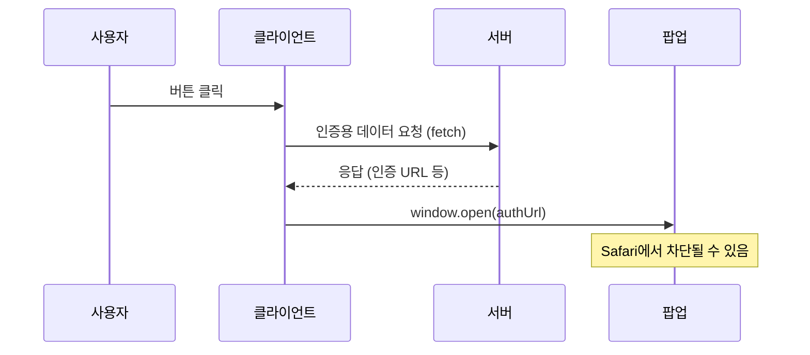
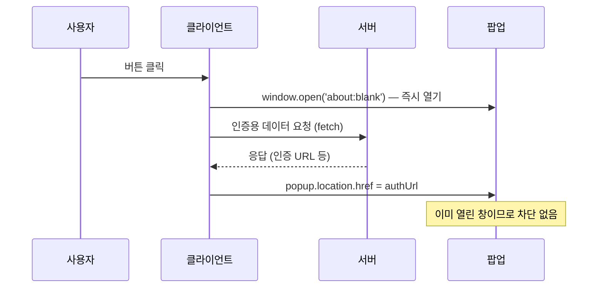

# Safari에서 본인인증/로그인 팝업이 차단되는 이유와 해결 방법

> 한줄 정의: Safari는 비동기 작업 이후에 호출된 `window.open`을 사용자 제스처로 인정하지 않아 팝업을 차단하며, 이를 해결하려면 클릭 시점에 빈 팝업을 먼저 여는 방식을 사용해야 한다.

## 목차

- [개요](#개요)
- [원인: 사용자 제스처와 비동기 경계](#원인-사용자-제스처와-비동기-경계)
- [문제가 되는 흐름](#문제가-되는-흐름)
- [해결 방법: 빈 팝업 선점 패턴](#해결-방법-빈-팝업-선점-패턴)
- [실전 예시](#실전-예시)
- [요약](#요약)

## 개요

Safari에서 본인인증이나 OAuth 로그인, 결제처럼 새 창을 여는 기능이 간헐적으로 막히는 경우가 있다.
Chrome에서는 정상 동작하는데 Safari에서만 팝업이 열리지 않는다면, 팝업 자체의 문제가 아니라 **팝업을 여는 시점**이 원인일 가능성이 높다.

이 문제는 OAuth 로그인, 본인인증(PASS, 아이핀 등), PG 결제 모듈처럼 비동기 준비 작업 이후 새 창을 열어야 하는 모든 상황에서 발생할 수 있다.
프론트엔드 개발에서 자주 마주치는 브라우저 호환성 이슈 중 하나이며, 원인과 해결 패턴을 정확히 알아 두면 디버깅 시간을 줄일 수 있다.

## 원인: 사용자 제스처와 비동기 경계

모든 주요 브라우저는 사용자가 의도하지 않은 팝업을 차단하는 정책을 가지고 있다.
악성 사이트가 무분별하게 팝업을 띄우는 것을 방지하기 위한 것으로, 핵심 규칙은 하나다.

**사용자의 직접적인 행위(제스처)에 의해 열린 팝업만 허용한다.**

여기서 **사용자 제스처(User Gesture, User Activation)**란 사용자가 직접 수행한 인터랙션을 의미한다.
`click`, `keydown`, `touchstart` 같은 이벤트가 대표적이다.
브라우저는 이 제스처를 추적하며, 제스처가 발생한 이벤트 핸들러의 동기 실행 흐름 안에서 호출된 `window.open()`은 "사용자가 의도한 팝업"으로 간주한다.

문제는 이 제스처 인식에 **유효 범위**가 있다는 점이다.
이벤트 핸들러 내에서 `fetch`, `setTimeout`, `Promise` 같은 비동기 작업을 거친 뒤에 `window.open()`을 호출하면, 브라우저에 따라 이를 사용자 제스처의 연장선으로 볼 수도, 보지 않을 수도 있다.
Safari와 Chrome은 이 유효 범위를 다르게 해석한다.

| 구분 | Chrome | Safari |
|------|--------|--------|
| 동기 실행 중 `window.open()` | 허용 | 허용 |
| `setTimeout(fn, 0)` 후 `window.open()` | 허용 (짧은 지연) | 차단 가능 |
| `fetch` → `.then()` 후 `window.open()` | 허용 (일정 시간 내) | 차단 가능 |
| `async/await` 후 `window.open()` | 허용 (일정 시간 내) | 차단 가능 |

Chrome은 사용자 제스처의 유효 시간을 비교적 넉넉하게 설정하여, 비동기 작업 이후에도 일정 시간(약 5초) 내라면 팝업 호출을 허용하는 경향이 있다.

반면 **Safari는 비동기 경계를 넘는 순간 사용자 제스처가 끊어진 것으로 판단**할 수 있다.
`Promise.then()`, `async/await`, `setTimeout` 등으로 콜 스택이 한 번이라도 비워지면, 그 이후의 `window.open()`은 사용자 제스처와 무관한 스크립트 호출로 간주할 수 있다는 뜻이다.

> **Q: Safari에서 항상 비동기 이후 팝업이 차단되는 것인가?**
>
> 항상은 아니다. Safari의 정확한 내부 기준은 공개되지 않으며, 버전에 따라 동작이 달라질 수 있다.
> 그래서 "간헐적으로" 차단되는 것처럼 보이는 경우가 많다.
> 다만 비동기 경계 이후 팝업이 차단될 수 있다는 전제로 코드를 작성하는 것이 안전하다.

## 문제가 되는 흐름

많은 구현이 다음과 같은 흐름을 가진다.



코드로 표현하면 다음과 같다.

```js
button.addEventListener('click', async () => {
  // 1. 서버에 인증용 데이터를 요청한다
  const response = await fetch('/api/auth/prepare');
  const { authUrl } = await response.json();

  // 2. 응답을 받은 뒤 팝업을 연다
  // ❌ Safari에서 차단될 수 있다
  window.open(authUrl, '_blank', 'width=500,height=600');
});
```

이 코드에서 `window.open()`은 `await fetch()`가 완료된 이후에 실행된다.
Chrome에서는 클릭 이벤트의 연장선으로 취급하여 팝업을 허용하지만, Safari에서는 비동기 작업으로 인해 사용자 제스처 문맥이 끊어졌다고 판단하여 팝업을 차단할 수 있다.

## 해결 방법: 빈 팝업 선점 패턴

핵심 아이디어는 단순하다.
**팝업을 나중에 여는 것이 아니라, 클릭 직후 즉시 빈 팝업을 먼저 여는 것**이다.

`about:blank` 같은 빈 창을 동기적으로 선점한 뒤, 인증 데이터가 준비되면 그 창에 실제 인증 페이지를 로드하는 방식이다.



흐름을 정리하면 다음과 같다.

1. 사용자가 버튼을 클릭한다.
2. 그 즉시 빈 팝업을 연다. (`window.open('about:blank')`)
3. 서버에서 인증용 데이터를 비동기로 가져온다.
4. 준비가 끝나면 이미 열린 팝업에 인증 페이지를 띄운다.
5. 실패하면 미리 연 팝업을 닫는다.

이 방식은 Safari 정책을 억지로 우회하는 꼼수가 아니다.
브라우저가 허용하는 사용자 제스처 조건에 맞춘 표준적인 처리 방식에 가깝다.
실제로 OAuth 로그인, 결제 모듈, 본인인증처럼 비동기 준비가 필요한 팝업에서 자주 쓰인다.

> **Q: 빈 팝업이 열린 상태에서 사용자가 기다려야 하는 것이 UX에 문제가 되지 않는가?**
>
> 빈 흰색 창이 잠깐 보이는 것은 사실이다.
> 이를 개선하려면 빈 팝업에 로딩 메시지를 넣을 수 있다.
> `popup.document.write('<p>인증 페이지를 준비 중입니다...</p>')` 같은 간단한 처리로 사용자에게 피드백을 제공하면 된다.

## 실전 예시

다음은 빈 팝업 선점 패턴을 적용한 완전한 코드다.
범용 함수를 먼저 만들고, 이를 활용하는 두 가지 시나리오(URL 리다이렉트, form submit)를 차례로 살펴본다.

**범용 함수**

```js
/**
 * 비동기 준비가 필요한 팝업을 Safari에서도 안전하게 여는 함수
 * @param {Function} prepareAsync - 인증 URL을 반환하는 비동기 함수
 * @param {Object} options - 팝업 옵션
 */
async function openPopupSafely(prepareAsync, options = {}) {
  const {
    width = 500,
    height = 600,
    loadingMessage = '페이지를 준비 중입니다...',
  } = options;

  // 1. 클릭 이벤트의 동기 실행 흐름 안에서 빈 팝업을 먼저 연다
  const popup = window.open(
    'about:blank',
    '_blank',
    `width=${width},height=${height}`
  );

  // 팝업이 차단된 경우 (사용자가 브라우저 설정에서 팝업을 완전히 차단한 경우)
  if (!popup) {
    alert('팝업이 차단되었습니다. 브라우저 설정에서 팝업을 허용해 주세요.');
    return;
  }

  // 2. 로딩 메시지를 표시한다
  popup.document.write(`
    <html>
      <body style="display:flex;justify-content:center;align-items:center;height:100vh;margin:0;font-family:sans-serif;">
        <p>${loadingMessage}</p>
      </body>
    </html>
  `);

  try {
    // 3. 비동기로 인증 데이터를 준비한다
    const targetUrl = await prepareAsync();

    // 4. 이미 열린 팝업에 실제 URL을 로드한다
    popup.location.href = targetUrl;
  } catch (error) {
    // 5. 실패하면 팝업을 닫는다
    popup.close();
    console.error('팝업 준비 실패:', error);
  }
}
```

위 함수를 사용하면 OAuth 로그인 같은 시나리오를 간결하게 처리할 수 있다.

**OAuth 로그인에 적용**

```js
document.getElementById('login-btn').addEventListener('click', () => {
  openPopupSafely(
    async () => {
      const response = await fetch('/api/auth/oauth/prepare', {
        method: 'POST',
        headers: { 'Content-Type': 'application/json' },
        body: JSON.stringify({ provider: 'google' }),
      });

      if (!response.ok) {
        throw new Error('인증 준비에 실패했습니다.');
      }

      const { authUrl } = await response.json();
      return authUrl;
    },
    { loadingMessage: '로그인 페이지를 준비 중입니다...' }
  );
});
```

한편, 일부 본인인증 모듈은 URL 리다이렉트가 아니라 form submit 방식으로 동작한다.
이 경우에도 동일한 패턴을 적용할 수 있다.
차이점은 `popup.location.href` 대신 `form.target`으로 이미 열린 팝업에 데이터를 전달한다는 것이다.

**form submit 방식에 적용**

```js
document.getElementById('verify-btn').addEventListener('click', async () => {
  // 1. 빈 팝업을 먼저 연다. name을 지정하여 form의 target과 연결한다.
  const popup = window.open('about:blank', 'authPopup', 'width=500,height=600');

  if (!popup) {
    alert('팝업이 차단되었습니다. 브라우저 설정에서 팝업을 허용해 주세요.');
    return;
  }

  try {
    // 2. 서버에서 인증 데이터를 가져온다
    const response = await fetch('/api/auth/prepare');
    const { actionUrl, encData, tokenVersionId } = await response.json();

    // 3. 동적으로 form을 생성하여 이미 열린 팝업에 submit한다
    const form = document.createElement('form');
    form.method = 'POST';
    form.action = actionUrl;
    form.target = 'authPopup'; // 팝업의 name과 일치시킨다

    const fields = { enc_data: encData, token_version_id: tokenVersionId };

    Object.entries(fields).forEach(([name, value]) => {
      const input = document.createElement('input');
      input.type = 'hidden';
      input.name = name;
      input.value = value;
      form.appendChild(input);
    });

    document.body.appendChild(form);
    form.submit();
    document.body.removeChild(form);
  } catch (error) {
    popup.close();
    console.error('본인인증 준비 실패:', error);
  }
});
```

> **Q: `window.open`의 두 번째 인자(name)는 왜 중요한가?**
>
> `window.open('about:blank', 'authPopup')`처럼 name을 지정하면, 이후 `form.target = 'authPopup'`으로 해당 창에 form submit을 보낼 수 있다.
> name을 지정하지 않거나 `_blank`로 설정하면 form submit 시 새 창이 또 열릴 수 있으므로, form 방식을 사용할 때는 반드시 name을 맞춰야 한다.

## 요약

- Safari는 비동기 작업(`fetch`, `await`, `setTimeout`) 이후에 호출된 `window.open()`을 사용자 제스처로 인정하지 않아 팝업을 차단할 수 있다.
- Chrome은 비동기 이후에도 일정 시간 내라면 팝업을 허용하는 경향이 있어, Chrome에서만 테스트하면 이 문제를 놓치기 쉽다.
- 해결 방법은 **클릭 직후 동기적으로 빈 팝업(`about:blank`)을 먼저 연 뒤**, 비동기 작업이 끝나면 해당 창에 실제 URL을 로드하는 것이다.
- 이 패턴은 `popup.location.href` 방식과 `form.target` 방식 모두에 적용할 수 있다.
- 비동기 준비 실패 시에는 미리 열어 둔 팝업을 `popup.close()`로 닫아 정리한다.
