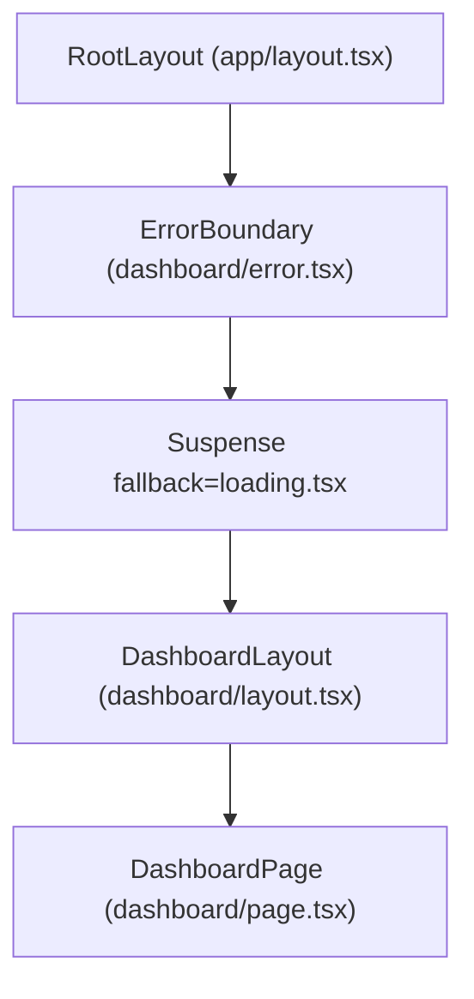
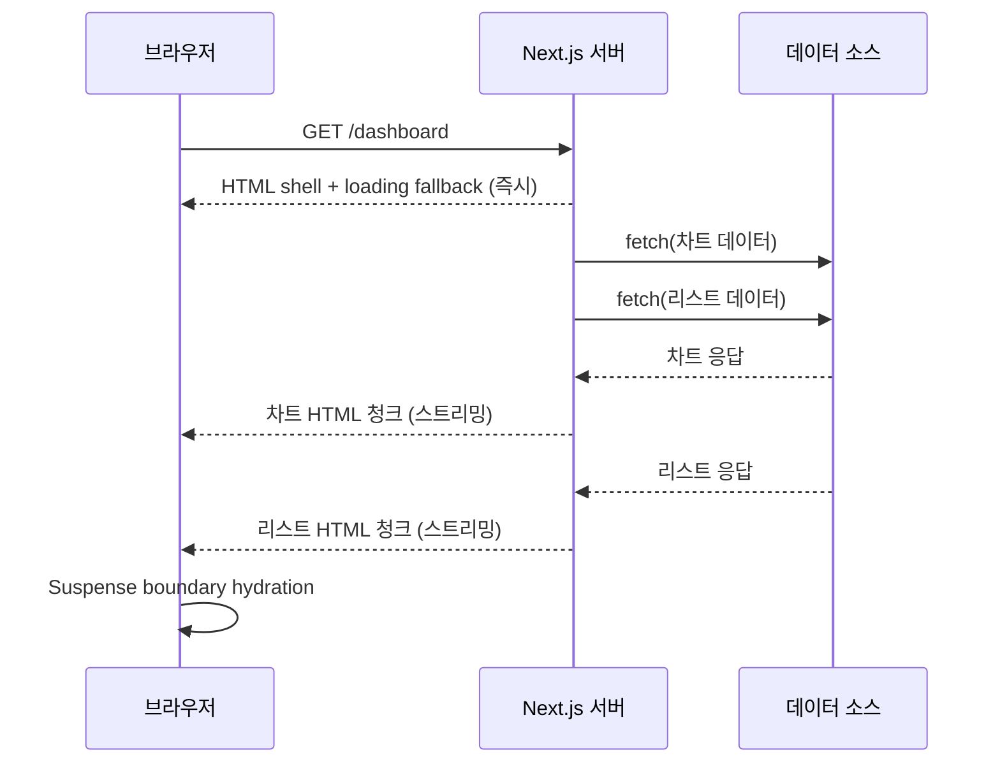

# Next.js App Router와 Server Components

> 한줄 정의: App Router는 React Server Components를 기반으로 한 Next.js의 파일 시스템 라우터이며, 서버/클라이언트 경계, 데이터 패칭, 캐싱, 스트리밍을 프레임워크 차원에서 통합한 구조다.

## 목차

- [개요](#개요)
- [App Router 파일 규약](#app-router-파일-규약)
- [Server Components와 Client Components](#server-components와-client-components)
- [Next.js가 확장한 `fetch`](#nextjs가-확장한-fetch)
- [왜 axios를 App Router 서버에서 쓰면 안 되는가](#왜-axios를-app-router-서버에서-쓰면-안-되는가)
- [캐싱의 네 계층](#캐싱의-네-계층)
- [Streaming과 Suspense](#streaming과-suspense)
- [React Query와의 조합 전략](#react-query와의-조합-전략)
- [요약](#요약)
- [참고](#참고)

## 개요

Next.js는 12 버전까지 `pages/` 디렉터리 기반의 라우터를 사용해 왔다. 이 구조에서 데이터 패칭은 `getServerSideProps`, `getStaticProps`, `getInitialProps` 같은 페이지 단위 함수로 제한되었고, 그 결과는 항상 전체 페이지의 초기 props로 직렬화되어 클라이언트까지 전달되었다.

이 방식은 **페이지 단위로만 서버 작업을 정의할 수 있다는 제약**을 가진다. 페이지 하단의 작은 사이드바 하나 때문에 페이지 전체의 캐시 전략이 결정되거나, 서버에서만 필요한 데이터가 클라이언트 번들의 일부로 내려가는 비효율이 자주 발생한다.

Next.js 13에서 도입되고 14에서 안정화된 **App Router**는 React Server Components(이하 RSC) 위에서 이 구조를 재설계한다. 각 컴포넌트가 독립적으로 서버/클라이언트 실행 위치를 선택하고, 데이터 패칭은 컴포넌트 단위로 분산되며, 캐시 전략은 요청 단위로 세밀하게 제어된다.

이 글은 Next.js 14 App Router를 기준으로 다음 흐름을 정리한다.

1. 파일 규약(`layout`, `page`, `loading`, `error`)이 어떤 계층 구조를 만드는가
2. Server Component와 Client Component는 무엇이 다르며 언제 나누어야 하는가
3. Next.js가 패치한 `fetch`는 기존 `fetch`와 어떻게 다른가
4. 왜 서버 코드에서 `axios`를 쓰는 것이 권장되지 않는가
5. 네 개의 캐시 계층은 각각 무엇을 캐싱하는가
6. `loading.tsx`와 `<Suspense>`를 이용한 스트리밍은 어떻게 작동하는가
7. React Query를 완전히 버려야 하는가, 아니면 어떤 역할로 남겨야 하는가

## App Router 파일 규약

App Router는 `app/` 디렉터리 안에서 **폴더 = 라우트 세그먼트**라는 규칙을 따른다. 각 폴더는 URL의 한 조각에 대응하며, 폴더 안에 특정 이름의 파일을 두면 Next.js가 정해진 역할로 읽어들인다.

| 파일 | 역할 | 기본 실행 위치 |
|------|------|----------------|
| `page.tsx` | 해당 라우트의 본체 UI. 이 파일이 있어야 라우트가 공개된다 | Server Component |
| `layout.tsx` | 하위 라우트가 공유하는 래퍼. 내비게이션 간 상태를 유지한다 | Server Component |
| `loading.tsx` | 하위 트리가 아직 준비되지 않았을 때 보여줄 UI. 내부적으로 `<Suspense>` 경계를 만든다 | Server Component |
| `error.tsx` | 하위 트리에서 던져진 오류를 잡는 경계. `<ErrorBoundary>`로 감싼다 | **Client Component 필수** |
| `not-found.tsx` | `notFound()` 호출 시 표시할 UI | Server Component |
| `template.tsx` | `layout`과 유사하지만 내비게이션마다 새 인스턴스가 생성된다 | Server Component |

### 중첩 구조의 렌더 트리

다음과 같은 폴더 구조가 있다고 하자.

```
app/
├── layout.tsx              // 루트 레이아웃
├── page.tsx                // "/"
└── dashboard/
    ├── layout.tsx          // "/dashboard" 하위 공용
    ├── loading.tsx         // Suspense fallback
    ├── error.tsx           // ErrorBoundary fallback
    └── page.tsx            // "/dashboard"
```

실제 렌더링되는 트리는 다음과 같이 쌓인다.



이 중첩은 하나의 결정적 구조다. `layout`은 안쪽 세그먼트가 바뀌어도 다시 마운트되지 않기 때문에, 내부의 `useState`나 스크롤 위치 같은 상태가 내비게이션 간에 보존된다.

> **Q: `layout.tsx`는 왜 Client Component가 아니어도 상태가 유지되는가?**
>
> 여기서 말하는 "상태"는 리액트 컴포넌트 내부 상태가 아니라 **DOM 트리와 렌더 트리의 연속성**이다. 클라이언트 내비게이션 시 Next.js의 라우터가 바뀐 세그먼트만 교체하기 때문에, 바뀌지 않은 상위 `layout`의 DOM과 그 안에 포함된 Client Component의 상태는 자연스럽게 유지된다.

### `loading.tsx`와 `error.tsx`

`loading.tsx`는 같은 폴더의 `page.tsx`(와 그 하위 트리)를 `<Suspense>`로 암묵적으로 감싼다. 서버가 해당 세그먼트의 데이터를 기다리는 동안 이 파일의 UI가 스트리밍되어 먼저 표시된다.

`error.tsx`는 반드시 상단에 `'use client'` 지시어를 포함해야 한다. React의 `ErrorBoundary`가 클래스 컴포넌트이고 클라이언트 전용 API에 의존하기 때문이다. Next.js가 주입하는 `reset` 함수를 호출하면 해당 경계가 다시 시도된다.

```tsx
'use client';

export default function Error({
  error,
  reset,
}: {
  error: Error & { digest?: string };
  reset: () => void;
}) {
  return (
    <div>
      <p>문제가 발생했습니다.</p>
      <button onClick={() => reset()}>다시 시도</button>
    </div>
  );
}
```

## Server Components와 Client Components

App Router의 모든 컴포넌트는 **기본적으로 Server Component**다. Server Component는 서버에서만 실행되고, 결과는 HTML과 RSC Payload(직렬화된 React 트리)로만 클라이언트에 전달된다. 컴포넌트 함수 자체의 JavaScript 코드는 클라이언트 번들에 포함되지 않는다.

특정 파일을 Client Component로 전환하려면 파일 최상단에 `'use client'` 지시어를 둔다. 이 지시어는 **파일 경계**를 의미하며, 이 파일에서 import 한 다른 파일 역시 클라이언트 번들에 포함된다.

```tsx
// components/Counter.tsx
'use client';

import { useState } from 'react';

export function Counter() {
  const [count, setCount] = useState(0);
  return <button onClick={() => setCount(count + 1)}>{count}</button>;
}
```

### 서버에서 클라이언트로 전달되는 props의 직렬화

Server Component가 Client Component를 렌더링할 때, props는 서버에서 직렬화되어 클라이언트에 전달된다. 이 때문에 **모든 props가 전달 가능한 것은 아니다**.

| 전달 가능 | 전달 불가 |
|-----------|-----------|
| 원시 값(string, number, boolean, null, undefined) | 함수(단, Server Action은 예외) |
| 일반 객체, 배열 | 클래스 인스턴스 |
| Date, Map, Set, BigInt | Symbol |
| Promise(RSC에서 지원) | 파일 시스템 핸들, DB 커넥션 등 |
| React 엘리먼트(`children` 포함) | 순환 참조 객체 |

함수 prop은 원칙적으로 전달할 수 없지만, `'use server'` 지시어가 붙은 **Server Action**은 예외적으로 참조 ID 형태로 직렬화되어 클라이언트에서 호출 가능해진다.

### 언제 Server Component로, 언제 Client Component로

| 기준 | Server Component | Client Component |
|------|------------------|------------------|
| `useState`, `useEffect` 등 훅 사용 | 불가 | 가능 |
| 이벤트 핸들러(`onClick`, `onChange`) | 불가 | 가능 |
| 브라우저 API(`window`, `localStorage`) | 불가 | 가능 |
| DB/파일 시스템 직접 접근 | 가능 | 불가 |
| 비밀 키/토큰 사용 | 가능 | 노출 위험으로 불가 |
| 대형 라이브러리(예: 마크다운 파서) | 서버에서만 실행되어 번들 크기 0 | 클라이언트 번들에 포함 |

실무적으로는 **가능한 한 Server Component로 두고, 상호작용이 필요한 잎(leaf) 부분만 Client Component로 분리**하는 것이 일반적인 패턴이다. 전체 페이지를 Client Component로 감싸면 App Router의 이점이 대부분 사라진다.

> **Q: Server Component에서 `useState`를 쓰면 왜 에러가 나는가?**
>
> `useState`는 React의 hooks 시스템이 유지하는 상태 슬롯에 의존하고, 이 시스템은 클라이언트 런타임에서만 작동한다. Server Component는 요청마다 한 번만 실행되고 즉시 직렬화되므로 "다시 렌더"라는 개념이 없으며, 따라서 상태를 보존할 주체가 존재하지 않는다.

> **Q: Client Component는 서버에서 실행되지 않는가?**
>
> 초기 로드 시에는 Client Component도 서버에서 한 번 실행되어 HTML로 변환된다(SSR). 다만 이후 hydration과 업데이트는 클라이언트에서 일어나며, 해당 컴포넌트의 JS 번들은 클라이언트로 함께 내려간다. "Client"라는 이름은 "클라이언트에서만 실행된다"가 아니라 **클라이언트 런타임에 참여한다**는 뜻에 가깝다.

## Next.js가 확장한 `fetch`

App Router 환경에서 `fetch`는 단순한 HTTP 클라이언트가 아니다. Next.js는 Node.js 런타임의 전역 `fetch`를 패치하여 **캐싱, 재검증, 요청 중복 제거**를 자동으로 처리한다.

### 확장된 옵션

Next.js는 표준 `RequestInit`에 자체 옵션을 추가한다.

```ts
fetch(url, {
  cache: 'force-cache',        // 또는 'no-store'
  next: {
    revalidate: 60,            // 초 단위. 60초 후 백그라운드 재검증
    tags: ['posts', 'user-42'] // revalidateTag()로 무효화할 태그
  },
});
```

| 옵션 | 의미 |
|------|------|
| `cache: 'force-cache'` | Data Cache에 저장하고 이후 요청은 캐시에서 읽는다. Next.js 14의 기본값 |
| `cache: 'no-store'` | 캐시하지 않는다. 매 요청마다 원본 호출 |
| `next.revalidate: N` | N초 경과 후 다음 요청 때 백그라운드에서 재검증(ISR 유사 동작) |
| `next.revalidate: 0` | `cache: 'no-store'`와 동일하게 해석된다 |
| `next.tags: [...]` | 태그를 붙여두고 `revalidateTag('태그명')`로 선택적 무효화 |

Next.js 14 기준 기본 캐시 정책은 `force-cache`에 가깝다. 다만 `cookies()`, `headers()` 같은 동적 함수를 사용하거나 `dynamic = 'force-dynamic'`을 지정한 세그먼트에서는 강제로 매 요청 실행된다.

### Request Memoization

같은 렌더 사이클 안에서 동일한 URL과 옵션으로 `fetch`를 여러 번 호출하면, Next.js는 내부적으로 첫 호출의 Promise를 재사용한다. 이 메커니즘을 **Request Memoization**이라고 부른다.

```tsx
// app/posts/[id]/page.tsx
async function getPost(id: string) {
  const res = await fetch(`https://api.example.com/posts/${id}`);
  return res.json();
}

async function Title({ id }: { id: string }) {
  const post = await getPost(id);
  return <h1>{post.title}</h1>;
}

async function Body({ id }: { id: string }) {
  const post = await getPost(id); // 같은 URL 재호출 → 실제 네트워크 호출은 1번
  return <p>{post.body}</p>;
}

export default function Page({ params }: { params: { id: string } }) {
  return (
    <>
      <Title id={params.id} />
      <Body id={params.id} />
    </>
  );
}
```

Props를 드릴링하지 않고도 여러 컴포넌트가 각자 필요한 데이터를 직접 요청할 수 있다는 점이 중요하다. 이 패턴은 RSC에서 권장되는 데이터 구조화 방식이다.

> **Q: Request Memoization과 Data Cache는 같은 것인가?**
>
> 다르다. **Request Memoization은 하나의 렌더 사이클 안에서만 유효**하며 렌더가 끝나면 사라진다. **Data Cache는 요청과 배포를 가로질러 유지**되는 영속적 캐시로, `fetch`의 `cache`/`next.revalidate` 옵션으로 제어한다. 같은 fetch 호출이 두 계층을 모두 통과하는 구조다.

## 왜 axios를 App Router 서버에서 쓰면 안 되는가

`axios`는 오랫동안 React 프로젝트의 기본 HTTP 클라이언트로 자리잡았다. 인터셉터, 자동 JSON 파싱, 요청 취소 등 편의 기능이 잘 갖춰져 있기 때문이다. 그러나 **Server Component 안에서 `axios`를 쓰는 것은 권장되지 않는다**.

### 핵심 이유: Next.js의 확장을 통과하지 않는다

Next.js의 데이터 관련 최적화는 거의 전부 **패치된 전역 `fetch`**를 경유해 일어난다. `axios`는 Node.js 환경에서 `http`/`https` 모듈을 직접 사용하거나 XHR을 쓰므로, Next.js가 제공하는 계층을 우회한다.

| 기능 | Next.js `fetch` | 서버 측 `axios` |
|------|-----------------|------------------|
| Data Cache 적용 | 적용됨 | 적용되지 않음 |
| `revalidate` 옵션 | 동작함 | 동작하지 않음 |
| `tags` 기반 무효화(`revalidateTag`) | 동작함 | 동작하지 않음 |
| Request Memoization | 자동 적용 | 적용되지 않음 |
| 빌드 시 정적 생성에 포함 | 포함됨 | 포함되지 않아 동적 렌더로 간주될 수 있음 |

그 결과, 서버에서 `axios`로 데이터를 가져오면 App Router의 핵심 가치인 **세분화된 캐시 전략을 구현할 수 없다**. 페이지는 매 요청마다 동적으로 렌더되기 쉽고, 동일 렌더 안에서 같은 요청을 여러 번 보내는 중복도 방지되지 않는다.

### 부가적인 이유

- **번들 크기**: Node 18+ 런타임과 최신 Next.js는 전역 `fetch`를 기본 제공한다. `axios`는 추가 의존성이 된다. Server Component는 클라이언트 번들에 포함되지 않지만, 서버 번들 크기와 cold start 시간에는 영향을 준다.
- **타입 일관성**: 공식 문서 예시가 거의 모두 `fetch` 기반이라 참고 자료와 실제 코드의 괴리가 생긴다.

### 클라이언트에서의 `axios`는 경우가 다르다

Client Component에서 브라우저가 직접 API를 호출하는 경우, Next.js의 Data Cache는 애초에 개입하지 않는다. 이 영역에서는 `axios`를 계속 써도 기능적 손실은 없다. 다만 프로젝트 전체의 일관성을 위해 `fetch` 기반의 경량 래퍼나 React Query 같은 라이브러리로 통일하는 쪽이 관리가 편하다.

> **Q: 기존 코드의 `axios` 인터셉터(토큰 주입, 에러 변환 등)를 `fetch`로 어떻게 옮기는가?**
>
> `fetch` 자체에는 인터셉터 개념이 없다. 실무에서는 `fetch`를 래핑한 얇은 함수를 하나 두고, 그 함수 안에서 토큰 주입과 공통 에러 처리를 수행한다. Server Component에서는 이 래퍼를 `async` 함수로, Client Component에서는 React Query의 `queryFn`으로 사용하면 단일한 추상화를 유지할 수 있다.

```ts
// lib/apiFetch.ts
export async function apiFetch<T>(
  path: string,
  init?: RequestInit & { next?: { revalidate?: number; tags?: string[] } },
): Promise<T> {
  const res = await fetch(`${process.env.API_BASE_URL}${path}`, {
    ...init,
    headers: {
      'Content-Type': 'application/json',
      ...(init?.headers ?? {}),
    },
  });

  if (!res.ok) {
    throw new Error(`API ${res.status}: ${await res.text()}`);
  }

  return res.json() as Promise<T>;
}
```

## 캐싱의 네 계층

App Router는 네 개의 서로 다른 캐시 계층을 갖는다. 이름이 비슷해 혼동하기 쉬우므로 각각의 **범위, 수명, 무효화 방법**을 분리해서 기억하는 편이 낫다.

| 계층 | 범위 | 수명 | 무효화 |
|------|------|------|--------|
| Request Memoization | 한 번의 요청/렌더 사이클 | 렌더 종료 시 폐기 | 자동(렌더 종료) |
| Data Cache | 서버 전역 | 영속적(재배포 후에도 유지될 수 있음) | `revalidate`, `revalidateTag()`, `revalidatePath()` |
| Full Route Cache | 서버 전역 | 빌드 시점 또는 `revalidate` 주기 | `revalidatePath()`, 재배포 |
| Router Cache | 개별 브라우저 세션 | 세션 동안 짧게 유지 | 내비게이션, `router.refresh()` |

### Request Memoization

앞 장에서 설명한 대로, 같은 렌더 안에서 동일한 `fetch` 호출을 중복 제거한다. React 수준의 기능이며 서버에서만 작동한다.

### Data Cache

`fetch` 단위의 **영속적 캐시**다. `cache: 'force-cache'`(기본값)일 때 결과가 저장되고, 이후 같은 요청은 원본 API를 호출하지 않고 캐시에서 바로 읽어온다. `next.revalidate`로 수명을 지정하거나, `next.tags`를 붙여 수동 무효화할 수 있다.

```ts
// 1시간 후 재검증
await fetch(url, { next: { revalidate: 3600 } });

// 태그 기반
await fetch(url, { next: { tags: ['posts'] } });

// 어딘가의 Server Action 또는 Route Handler에서
import { revalidateTag } from 'next/cache';
revalidateTag('posts');
```

### Full Route Cache

**라우트 단위**로 빌드 시점에 생성된 HTML과 RSC Payload를 캐싱한다. 정적으로 렌더 가능한 페이지는 빌드 시 한 번만 생성되고, 같은 URL의 모든 요청이 이 결과를 공유한다.

어떤 페이지가 정적 렌더에서 제외되는지는 동적 함수 사용 여부로 결정된다. `cookies()`, `headers()`, `searchParams`(page.tsx의 prop) 같은 함수를 읽거나, `cache: 'no-store'`/`revalidate: 0`인 `fetch`를 사용하거나, 세그먼트 구성 옵션에 `export const dynamic = 'force-dynamic'`를 지정하면 그 세그먼트는 동적 렌더링 대상이 된다.

### Router Cache

클라이언트 브라우저의 메모리에 저장되는 캐시다. 클라이언트 내비게이션으로 이미 방문한 라우트의 RSC Payload를 잠시 보관해두고, 사용자가 뒤로 갔다가 돌아올 때 즉시 복원한다.

수명은 짧고 자동으로 관리된다. 강제로 비우려면 Client Component에서 `router.refresh()`를 호출하거나, Server Action에서 `revalidatePath()`를 호출한다.

> **Q: 캐시를 전부 끄고 싶을 때 어디까지 설정해야 하는가?**
>
> 세 곳을 함께 고려해야 한다. ① `fetch`에 `cache: 'no-store'` 또는 `next.revalidate: 0`, ② 세그먼트 파일(`page.tsx` 또는 `layout.tsx`)에 `export const dynamic = 'force-dynamic'`, ③ 필요에 따라 `export const revalidate = 0`. `fetch` 옵션만 바꾼다고 Full Route Cache까지 꺼지는 것은 아니므로, 페이지 전체를 동적으로 유지하려면 세그먼트 옵션도 함께 지정해야 한다.

## Streaming과 Suspense

App Router는 **HTML을 한 번에 완성된 상태로 내려보내지 않는다**. 서버는 페이지를 렌더하는 도중에도 이미 준비된 부분을 먼저 HTTP 응답으로 흘려보내고, 느린 부분은 나중에 추가 청크로 이어 붙인다. 이 방식을 Streaming이라 부른다.

### `loading.tsx`가 만드는 암묵적 `<Suspense>`

세그먼트 폴더에 `loading.tsx`를 두면 Next.js는 해당 세그먼트의 `page.tsx`를 자동으로 `<Suspense>`로 감싸고, `loading.tsx`의 UI를 fallback으로 사용한다. 서버는 `loading`의 HTML을 즉시 보내고, 데이터가 준비되면 실제 콘텐츠로 교체한다.

```tsx
// app/dashboard/loading.tsx
export default function Loading() {
  return <div aria-busy="true">로딩 중…</div>;
}

// app/dashboard/page.tsx
export default async function DashboardPage() {
  const data = await getDashboardData(); // 느린 호출
  return <DashboardView data={data} />;
}
```

### 명시적 `<Suspense>`로 부분 스트리밍

같은 페이지 안에서도 빠른 부분과 느린 부분을 분리하여, 느린 부분만 별도의 Suspense 경계로 감싸면 빠른 부분이 먼저 사용자에게 노출된다.

```tsx
import { Suspense } from 'react';

export default function Page() {
  return (
    <section>
      <Header />
      <Suspense fallback={<ChartSkeleton />}>
        <SlowChart />
      </Suspense>
      <Suspense fallback={<ListSkeleton />}>
        <SlowList />
      </Suspense>
    </section>
  );
}

async function SlowChart() {
  const data = await fetch(API_CHART, { next: { revalidate: 60 } }).then(r => r.json());
  return <Chart data={data} />;
}
```

`SlowChart`와 `SlowList`는 독립적으로 스트리밍된다. 두 호출이 병렬로 진행되며, 먼저 끝난 쪽의 HTML이 먼저 교체된다.

### 스트리밍 흐름



스트리밍의 핵심은 **HTTP 응답이 chunked transfer로 이어지는 동안 React가 추가 렌더 결과를 계속 밀어 넣는다**는 점이다. 전통적인 `getServerSideProps`는 모든 데이터가 준비될 때까지 응답 자체를 시작하지 않지만, App Router는 페이지의 껍데기와 첫 번째 Suspense 경계까지를 일찍 보낸다.

> **Q: `loading.tsx` 대신 명시적 `<Suspense>`를 쓰는 편이 더 나은가?**
>
> 용도가 다르다. `loading.tsx`는 **라우트 전환 시** 세그먼트 전체에 대한 fallback이고, 명시적 `<Suspense>`는 **같은 페이지 안의 부분 영역**에 대한 경계다. 라우트 레벨 로딩은 `loading.tsx`로, 페이지 내부의 느린 위젯은 `<Suspense>`로 나누어 쓰는 구성이 일반적이다.

## React Query와의 조합 전략

App Router로 마이그레이션할 때 자주 나오는 질문은 "React Query(TanStack Query)를 계속 써도 되는가"이다. 답은 **쓰긴 쓰되, 역할을 재배치해야 한다**.

### 기본 원칙

- **서버에서 가져올 수 있는 데이터는 Server Component + `fetch`로 가져온다.**
  초기 렌더에 필요한 데이터를 RSC에서 직접 가져오면 클라이언트 번들이 가벼워지고, Data Cache의 혜택을 받는다.
- **React Query는 클라이언트 상호작용 전용으로 남긴다.**
  무한 스크롤, 낙관적 업데이트, 주기적 폴링, 포커스 재동기화처럼 클라이언트 상태 관리가 본질인 기능에 제한적으로 사용한다.

### Hydration 패턴: 서버에서 prefetch 후 클라이언트로 전달

초기 데이터는 서버에서 미리 받아 두고, 클라이언트의 `useQuery`가 그 데이터를 재사용하도록 `dehydrate`/`HydrationBoundary`를 쓴다. 이 패턴은 초기 로드의 속도 이점(Server Component)과 이후 상호작용의 편의(React Query)를 모두 얻는다.

```tsx
// app/providers.tsx
'use client';

import { QueryClient, QueryClientProvider } from '@tanstack/react-query';
import { useState } from 'react';

export function Providers({ children }: { children: React.ReactNode }) {
  const [client] = useState(
    () =>
      new QueryClient({
        defaultOptions: { queries: { staleTime: 60 * 1000 } },
      }),
  );

  return <QueryClientProvider client={client}>{children}</QueryClientProvider>;
}
```

```tsx
// app/layout.tsx
import { Providers } from './providers';

export default function RootLayout({ children }: { children: React.ReactNode }) {
  return (
    <html lang="ko">
      <body>
        <Providers>{children}</Providers>
      </body>
    </html>
  );
}
```

```tsx
// app/posts/page.tsx (Server Component)
import { QueryClient, dehydrate, HydrationBoundary } from '@tanstack/react-query';
import { PostList } from './PostList';

async function fetchPosts() {
  const res = await fetch('https://api.example.com/posts', {
    next: { revalidate: 60, tags: ['posts'] },
  });
  return res.json();
}

export default async function PostsPage() {
  const queryClient = new QueryClient();

  await queryClient.prefetchQuery({
    queryKey: ['posts'],
    queryFn: fetchPosts,
  });

  return (
    <HydrationBoundary state={dehydrate(queryClient)}>
      <PostList />
    </HydrationBoundary>
  );
}
```

```tsx
// app/posts/PostList.tsx
'use client';

import { useQuery } from '@tanstack/react-query';

export function PostList() {
  const { data } = useQuery({
    queryKey: ['posts'],
    queryFn: async () => {
      const res = await fetch('/api/posts');
      return res.json();
    },
  });

  return (
    <ul>
      {data?.map((post: { id: string; title: string }) => (
        <li key={post.id}>{post.title}</li>
      ))}
    </ul>
  );
}
```

핵심은 `queryKey`가 서버와 클라이언트에서 동일해야 한다는 점이다. 동일한 키에 대한 데이터가 이미 `HydrationBoundary`로 주입되어 있기 때문에, 클라이언트의 `useQuery`는 네트워크 요청 없이 바로 캐시된 값을 사용한다.

### 요청마다 `QueryClient`를 새로 만들어야 하는 이유

Server Component에서 `QueryClient`를 모듈 스코프 변수로 두면, 서버 인스턴스는 여러 요청을 공유하게 되어 **요청 간 데이터가 섞일 위험**이 있다. `PostsPage` 예시처럼 함수 내부에서 `new QueryClient()`를 매번 생성하거나, 요청 단위로 캐시된 팩토리(`cache(() => new QueryClient())`)를 쓴다.

Client 측의 `Providers` 컴포넌트에서도 `useState(() => new QueryClient())`로 컴포넌트 수명 동안 한 번만 생성한다. 모듈 최상단에 `const queryClient = new QueryClient()`를 두면 Fast Refresh나 SSR 환경에서 여러 인스턴스 간 참조가 꼬일 수 있다.

> **Q: React Query를 아예 빼고 RSC와 Server Action만으로 갈 수도 있지 않은가?**
>
> 가능하다. 폼 기반 상호작용과 단순한 목록/상세 화면 위주라면 Server Action + `revalidateTag`로 충분할 수 있다. 다만 낙관적 업데이트가 빈번하거나, 한 화면에 여러 쿼리가 복잡하게 얽혀 있거나, 오프라인/재접속 동기화가 필요하다면 React Query의 캐시 모델과 mutation 도구가 여전히 유리할 수 있다.

## 요약

- App Router는 RSC 위에서 동작하는 파일 시스템 라우터이며, 서버/클라이언트 경계를 컴포넌트 단위로 세분화한다.
- `layout`, `page`, `loading`, `error` 네 파일 규약이 중첩 라우팅의 뼈대를 이룬다. `error.tsx`는 반드시 `'use client'`여야 한다.
- 모든 컴포넌트는 기본적으로 Server Component이며, 상호작용이 필요한 잎 부분만 `'use client'`로 전환하는 것이 권장 패턴이다.
- Next.js가 패치한 전역 `fetch`는 Data Cache, `revalidate`, `tags`, Request Memoization 기능을 제공한다.
- 서버 코드에서 `axios`를 쓰면 이 모든 기능을 우회하게 되므로, 서버에서는 `fetch` 래퍼를 쓰고 `axios`는 클라이언트 영역에 한정한다.
- 캐시는 Request Memoization, Data Cache, Full Route Cache, Router Cache 네 계층으로 나뉜다. 이름이 비슷하지만 범위와 수명이 모두 다르다.
- `loading.tsx`와 `<Suspense>`를 이용한 스트리밍은 페이지의 빠른 부분을 먼저 보내고 느린 부분을 나중에 이어 붙이는 방식으로 동작한다.
- React Query는 버리지 않고 클라이언트 상호작용 전용으로 재배치한다. 초기 데이터는 RSC에서 prefetch 한 뒤 `HydrationBoundary`로 넘긴다.

## 참고

- Next.js 공식 문서: [App Router](https://nextjs.org/docs/app)
- Next.js 공식 문서: [Data Fetching, Caching, and Revalidating](https://nextjs.org/docs/app/building-your-application/data-fetching)
- Next.js 공식 문서: [Caching](https://nextjs.org/docs/app/building-your-application/caching)
- Next.js 공식 문서: [Rendering - Server Components / Client Components](https://nextjs.org/docs/app/building-your-application/rendering)
- React 공식 문서: [Server Components](https://react.dev/reference/rsc/server-components)
- TanStack Query: [Advanced Server Rendering](https://tanstack.com/query/latest/docs/framework/react/guides/advanced-ssr)
