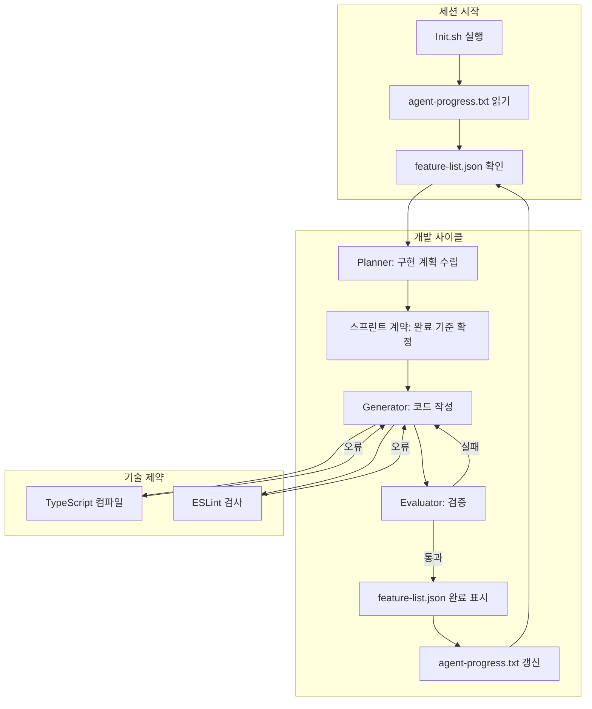

# 에이전트 워크플로우 프레임워크

> 한줄 정의: AI 에이전트의 작업 범위, 판단 기준, 진행 상태를 명시적으로 통제함으로써 자율주행에 가까운 개발 환경을 구성하는 프레임워크.

## 목차

- [개요](#개요)
- [도메인 지침 구축 관점](#도메인-지침-구축-관점)
- [LLM 도구 기술 관점](#llm-도구-기술-관점)
- [전체 흐름 다이어그램](#전체-흐름-다이어그램)
- [요약](#요약)

## 개요

"효율적인 소프트웨어 엔지니어가 매일 하는 일"이라는 개념에서 출발한 이 프레임워크는 AI 에이전트가 사람처럼 체계적으로 일하도록 하는 구조를 설계한다.

사람 엔지니어는 오전에 할 일 목록을 확인하고, 어제 어디까지 진행했는지 떠올리고, 오늘 무엇을 완료로 볼 것인지 스스로에게 물은 뒤 코드를 작성한다. 이 프레임워크는 그 과정을 에이전트에게도 동일하게 부여한다.

크게 두 층으로 나뉜다. 하나는 **에이전트가 어떻게 생각하고 움직이는가**를 설계하는 도메인 지침 구축 관점이고, 다른 하나는 **에이전트가 쓰는 언어와 도구에 제약을 걸어** 실수를 컴파일 타임에 잡는 기술 관점이다.

## 도메인 지침 구축 관점

### Feature List — JSON 백로그

백로그를 **JSON 형식의 기능 목록**으로 표현한다. 에이전트는 작업을 하나 완료할 때마다 해당 항목을 완료 상태로 표시한다.

```json
{
  "features": [
    { "id": "F-001", "title": "로그인 페이지 구현", "status": "done" },
    { "id": "F-002", "title": "JWT 토큰 검증 미들웨어", "status": "in-progress" },
    { "id": "F-003", "title": "사용자 프로필 API", "status": "pending" }
  ]
}
```

JSON을 선택한 이유는 **변조 저항성** 때문이다. 마크다운 체크리스트는 서식이 깨지거나 에이전트가 다른 내용을 덧붙이면 파악이 어렵다. JSON은 파서가 구조를 엄격하게 검증하므로 항목이 추가되거나 삭제되면 즉시 감지할 수 있다.

> **Q: 완료 표시를 에이전트가 직접 수정하면 실수가 생기지 않을까?**
>
> JSON 스키마를 고정해 두면 허용된 `status` 값(예: `"pending"`, `"in-progress"`, `"done"`, `"blocked"`)만 기입할 수 있다. CI 단계에서 스키마 검증을 추가하면 무효한 값이 병합되는 것을 막을 수 있다.

### Progress File — 맥락 인계 문서

`agent-progress.txt`는 에이전트가 매 작업 후 갱신하는 로그 파일이다. 새로운 세션이 시작될 때 에이전트는 이 파일을 먼저 읽어 이전 세션의 맥락을 복원한다.

```
[2026-04-23 14:30] F-001 완료: src/pages/login.tsx 구현, 테스트 통과
[2026-04-23 15:10] F-002 진행 중: 미들웨어 작성 완료, 토큰 만료 예외 처리 미완성
[2026-04-23 15:45] 블로커: refresh token 재발급 API 스펙 미확정 → 대기
```

이 파일이 없으면 에이전트는 새 세션마다 처음부터 코드를 탐색해야 한다. 맥락 재구성에 드는 시간과 토큰 비용이 늘어나고, 이전 결정이 왜 내려졌는지 추적하기 어려워진다.

> **Q: 파일이 너무 길어지면 어떻게 관리하는가?**
>
> 스프린트 단위로 파일을 로테이션하거나, 완료된 항목은 아카이브 파일로 분리한다. 현재 진행 중이거나 블로킹된 항목만 활성 파일에 유지하면 에이전트가 읽어야 할 양을 일정하게 유지할 수 있다.

### 스프린트 계약 — 완료 기준 선정의

코드를 한 줄 쓰기 전에 **"완료"가 무엇인지** 먼저 정한다. 이것이 스프린트 계약이다.

완료 기준은 추상적 문장이 아닌 구체적이고 검증 가능한 조건으로 작성한다. 대략 20~30개 항목이 적절하다.

```markdown
## F-002 완료 기준

- [ ] `Authorization: Bearer <token>` 헤더가 없으면 401 반환
- [ ] 만료된 토큰에 대해 403이 아닌 401 반환
- [ ] 유효한 토큰이면 `req.user`에 디코딩된 페이로드 주입
- [ ] 단위 테스트: 유효 토큰, 만료 토큰, 헤더 없음 3가지 케이스 통과
- [ ] `jest --coverage` 기준 해당 모듈 커버리지 80% 이상
- [ ] TypeScript strict 모드 오류 없음
```

완료 기준을 먼저 작성하면 에이전트가 구현 도중 "이 정도면 됐겠지"라고 판단하는 상황을 막는다. 체크리스트가 전부 통과되어야만 다음 기능으로 넘어갈 수 있다.

### Planner → Generator → Evaluator 구조

세 역할을 분리하여 각각 독립적인 에이전트(또는 에이전트 호출 단계)가 담당한다.

| 역할 | 책임 | 입력 | 출력 |
|------|------|------|------|
| **Planner** | 무엇을 어떻게 만들지 설계 | 기능 요구사항, 완료 기준 | 구현 계획, 파일 목록, 의존성 |
| **Generator** | 실제 코드 작성 | Planner의 계획 | 코드 파일, 테스트 |
| **Evaluator** | 완료 기준 충족 여부 검증 | Generator의 결과물, 완료 기준 | 통과/실패 판정, 피드백 |


Evaluator는 Playwright MCP 같은 브라우저 자동화 도구를 활용해 실제 사용자처럼 UI를 조작하며 검증한다. 단순히 코드가 컴파일되는지가 아니라, 화면에서 버튼을 누르고 응답을 확인하는 **행동 기반 검증**을 수행한다.

> **Q: Planner, Generator, Evaluator를 하나의 에이전트가 순서대로 수행하면 안 되는가?**
>
> 역할을 분리하는 핵심 이유는 **평가 편향 방지**다. 코드를 작성한 에이전트가 스스로 검증하면 자신이 만든 결과물에 관대해지는 경향이 있다. Evaluator를 별도 에이전트로 두면 Generator의 전제를 공유하지 않아 독립적인 판정을 내릴 수 있다.

### Init.sh — 환경 자가 점검

새 세션이 시작될 때 실행하는 셸 스크립트다. 개발 서버를 자동으로 시작하고, 기본 테스트를 돌려 환경이 정상인지 확인한다.

```bash
#!/bin/bash
set -e

echo "=== 환경 점검 ==="

# 의존성 설치 확인
if [ ! -d "node_modules" ]; then
  npm install
fi

# 타입 검사
npx tsc --noEmit
echo "✓ TypeScript 오류 없음"

# 린트
npx eslint src/
echo "✓ ESLint 통과"

# 단위 테스트
npm test -- --passWithNoTests
echo "✓ 기본 테스트 통과"

# 개발 서버 실행
npm run dev &
echo "✓ 개발 서버 기동 완료"

echo "=== 환경 준비 완료 ==="
```

이 스크립트가 없으면 에이전트는 환경이 정상인지 확인하지 않은 채 코드를 작성하다가 나중에 전혀 다른 원인의 오류를 만날 수 있다. Init.sh는 세션 시작의 의식이자 **빠른 실패(fast fail)** 장치다.

## LLM 도구 기술 관점

### 컴파일 단계 제약

에이전트가 작성하는 코드에 **TypeScript + ESLint**를 적용해 문제를 런타임이 아닌 컴파일 타임에 잡는다.

```json
// tsconfig.json
{
  "compilerOptions": {
    "strict": true,
    "noImplicitAny": true,
    "noUncheckedIndexedAccess": true,
    "exactOptionalPropertyTypes": true
  }
}
```

`strict` 모드를 켜면 에이전트가 타입을 `any`로 우회하거나 null 체크를 생략하는 것을 막는다. ESLint 규칙은 코딩 컨벤션을 강제한다.

```json
// .eslintrc.json
{
  "rules": {
    "no-console": "error",
    "prefer-const": "error",
    "@typescript-eslint/explicit-function-return-type": "error"
  }
}
```

이 제약들은 에이전트가 빠르게 동작하는 코드를 만들기 위해 품질을 타협하는 것을 방지한다. CI 파이프라인에서 타입 검사와 린트가 실패하면 병합 자체가 불가능하다.

> **Q: 제약이 너무 엄격하면 에이전트가 작동하는 코드를 만들기 어렵지 않은가?**
>
> 처음에는 에이전트가 규칙을 위반하려 시도하는 경우가 생길 수 있다. 하지만 제약이 일관되게 적용되면 에이전트는 점차 규칙을 준수하는 패턴을 학습한다. 초기에 제약 수준을 낮게 시작해 점진적으로 높이는 방식이 적합하다.

### 코드 스캐폴딩 일관성

파일 구조, 식별자 명명 규칙, 모듈 패턴을 일관되게 유지한다. 에이전트가 새 파일을 만들 때 기존 코드와 동일한 패턴을 따르도록 예시 파일을 프로젝트에 포함시킨다.

```
src/
├── features/
│   ├── auth/
│   │   ├── auth.controller.ts   ← 패턴 기준 파일
│   │   ├── auth.service.ts
│   │   └── auth.test.ts
│   └── user/
│       ├── user.controller.ts   ← 동일 구조 반복
│       ├── user.service.ts
│       └── user.test.ts
```

일관된 스캐폴딩은 에이전트가 낯선 모듈을 만들 때 어디에 무엇을 배치할지 추론하기 쉽게 만든다. 패턴이 없으면 에이전트마다 다른 방식으로 파일을 배치해 프로젝트 구조가 점차 일관성을 잃는다.

## 전체 흐름 다이어그램



## 요약

- **JSON 백로그**는 변조 저항성이 높고 파서로 검증 가능하여 에이전트의 작업 목록 관리에 적합하다.
- **Progress File**은 세션 간 맥락을 인계하는 핵심 문서로, 이것이 없으면 에이전트는 매번 처음부터 코드를 탐색해야 한다.
- **스프린트 계약**은 코드 작성 전에 완료 기준을 구체적으로 정의해 에이전트의 조기 종료를 막는다.
- **Planner → Generator → Evaluator** 분리는 평가 편향을 방지하고 독립적인 품질 검증을 가능하게 한다.
- **Init.sh**는 세션 시작 시 환경 정상 여부를 빠르게 확인하는 자가 점검 도구다.
- **TypeScript strict + ESLint**는 에이전트가 품질을 타협하지 못하도록 컴파일 타임에 제약을 건다.
- **일관된 스캐폴딩**은 에이전트가 낯선 모듈을 만들 때 기존 패턴을 추론하여 따를 수 있도록 한다.
