# Next.js 렌더링 전략, 캐시 전략, 번들러

> 한줄 정의: App Router 기준 Next.js는 단순 SSR 프레임워크가 아니라, "무엇을 캐시하고, 언제 재생성하며, 어디까지 hydration할 것인가"를 결정하는 **렌더링·캐시 오케스트레이션 프레임워크**입니다.

## 목차

- [개요](#개요)
- [렌더링 패러다임의 전환](#렌더링-패러다임의-전환)
  - [Pages Router와 App Router 비교](#pages-router와-app-router-비교)
- [주요 렌더링 전략](#주요-렌더링-전략)
  - [CSR (Client Side Rendering)](#csr-client-side-rendering)
  - [SSR (Server Side Rendering)](#ssr-server-side-rendering)
  - [SSG (Static Site Generation)](#ssg-static-site-generation)
  - [ISR (Incremental Static Regeneration)](#isr-incremental-static-regeneration)
  - [Streaming SSR](#streaming-ssr)
  - [RSC (React Server Components)](#rsc-react-server-components)
  - [Partial Prerendering (PPR)](#partial-prerendering-ppr)
- [fetch 캐시 전략](#fetch-캐시-전략)
  - [캐시 옵션별 동작](#캐시-옵션별-동작)
  - [Route Segment 설정](#route-segment-설정)
- [실무 조합 패턴](#실무-조합-패턴)
  - [일반적인 계층별 전략](#일반적인-계층별-전략)
  - [ViewModel 패턴과의 결합](#viewmodel-패턴과의-결합)
  - [대규모 트래픽 전략](#대규모-트래픽-전략)
- [번들러 비교](#번들러-비교)
  - [Webpack](#webpack)
  - [Vite](#vite)
  - [Turbopack](#turbopack)
  - [세 번들러 비교표](#세-번들러-비교표)
- [Next.js와 번들러 통합 구조](#nextjs와-번들러-통합-구조)
- [요약](#요약)

## 개요

Next.js를 처음 배울 때 흔히 "SSR과 SSG 중 어느 것을 사용할 것인가"라는 관점에서 접근하는 경우가 많습니다. Pages Router 시절에는 이 관점이 유효했습니다. `getServerSideProps`와 `getStaticProps`라는 명시적 API가 그 경계를 뚜렷하게 나누었기 때문입니다.

App Router로 전환된 이후 핵심 질문은 달라집니다. "어떤 데이터를 캐시하고, 얼마나 오래 유지하며, 언제 다시 생성할 것인가"가 더 중요한 관심사가 됩니다. 이 문서는 App Router 기준으로 각 렌더링 전략의 동작 원리, fetch 캐시 옵션, 그리고 번들러(Webpack·Vite·Turbopack)의 특성을 정리합니다.

## 렌더링 패러다임의 전환

### Pages Router와 App Router 비교

| 관점 | Pages Router | App Router |
|------|-------------|-----------|
| 핵심 질문 | SSR인가 SSG인가 | 언제 서버를 실행하고, 무엇을 캐시하는가 |
| API | `getServerSideProps`, `getStaticProps` | fetch 옵션, `dynamic`, `revalidate` 설정 |
| 단위 | 페이지 단위 | Route Segment 단위 |
| 기본값 | 명시적 선택 필요 | 프레임워크가 자동 추론 |

App Router에서 Next.js의 본질을 한 문장으로 정의하면 다음과 같습니다.

> **캐시 전략 + 렌더링 오케스트레이션 프레임워크**

핵심 관심사는 세 가지입니다.

- 언제 서버를 실행하는가
- 무엇을 캐시하는가
- 언제 재생성하는가

## 주요 렌더링 전략

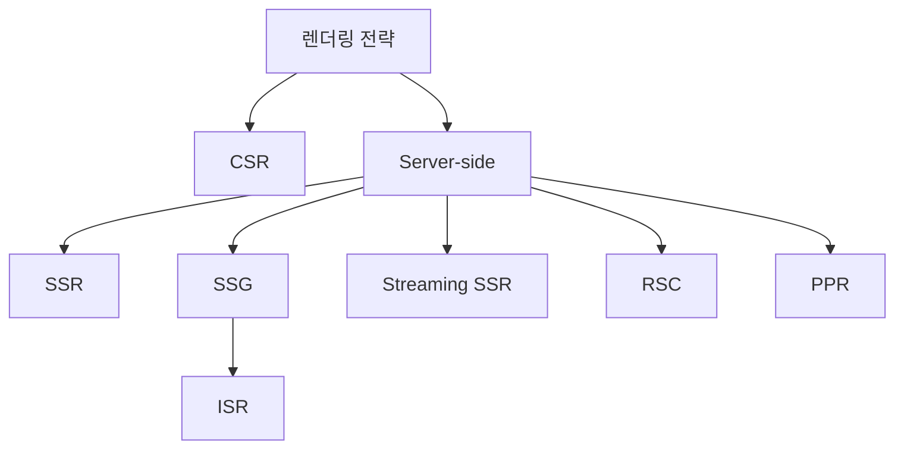

### CSR (Client Side Rendering)

**브라우저에서 JavaScript를 실행하여 화면을 렌더링하는 방식**입니다. 초기 HTML은 거의 비어 있고, JavaScript 번들이 다운로드된 이후 실제 콘텐츠가 화면에 나타납니다.

| 항목 | 내용 |
|------|------|
| 초기 HTML | 거의 비어 있음 |
| 데이터 fetch | 브라우저에서 실행 |
| SEO | 취약 (콘텐츠가 JS 실행 후 생성됨) |
| 인터랙션 | 강함 |
| 적합한 사례 | 대시보드, 관리자 페이지, 필터 UI, 장바구니, 실시간 인터랙션 |

CSR의 가장 큰 실수는 페이지 전체를 Client Component로 선언하는 것입니다.

```tsx
// 권장하지 않는 패턴
'use client'
export default function Page() {
  // 페이지 전체를 CSR로 처리
}
```

실무에서는 초기 화면 렌더링은 서버에서, 사용자 인터랙션 처리는 클라이언트에서 담당하는 방식으로 조합합니다.

```tsx
// 권장 패턴: Server Component가 초기 데이터를 가져오고, Client Component가 인터랙션 처리
export default async function Page() {
  const data = await getData()
  return <ClientSection initialData={data} />
}

// client/ClientSection.tsx
'use client'
export function ClientSection({ initialData }) {
  const [state, setState] = useState(initialData)
  // 인터랙션 처리
}
```

> **Q: 장바구니는 왜 CSR로 분류하는가?**
>
> 장바구니는 사용자별 상태, 빠른 인터랙션(수량 변경, 체크박스, 쿠폰 적용), 낙관적 업데이트(optimistic update)가 핵심입니다.
> 이 특성들은 서버 렌더링보다 클라이언트 상태 관리에 더 적합합니다.
> 실무에서는 초기 장바구니 데이터 로드는 SSR 또는 RSC로, 이후 조작 상태는 CSR로 처리하는 방식이 일반적입니다.

### SSR (Server Side Rendering)

**요청마다 서버에서 새로운 HTML을 생성하는 방식**입니다. 항상 최신 데이터를 제공하지만, 그만큼 서버 실행 비용이 발생합니다.

| 항목 | 내용 |
|------|------|
| 실행 시점 | 요청마다 |
| 데이터 | 항상 최신 |
| SEO | 강함 |
| 서버 비용 | 높음 |
| 적합한 사례 | 사용자별 데이터, 인증 기반 UI, 실시간 데이터 |

App Router에서 SSR로 동작시키려면 아래 중 하나의 조건을 만족해야 합니다.

```tsx
// 1. fetch 캐시 비활성화
const data = await fetch(url, { cache: 'no-store' })

// 2. cookies 또는 headers 접근
import { cookies } from 'next/headers'
const cookieStore = cookies()

// 3. Route Segment 강제 설정
export const dynamic = 'force-dynamic'
```

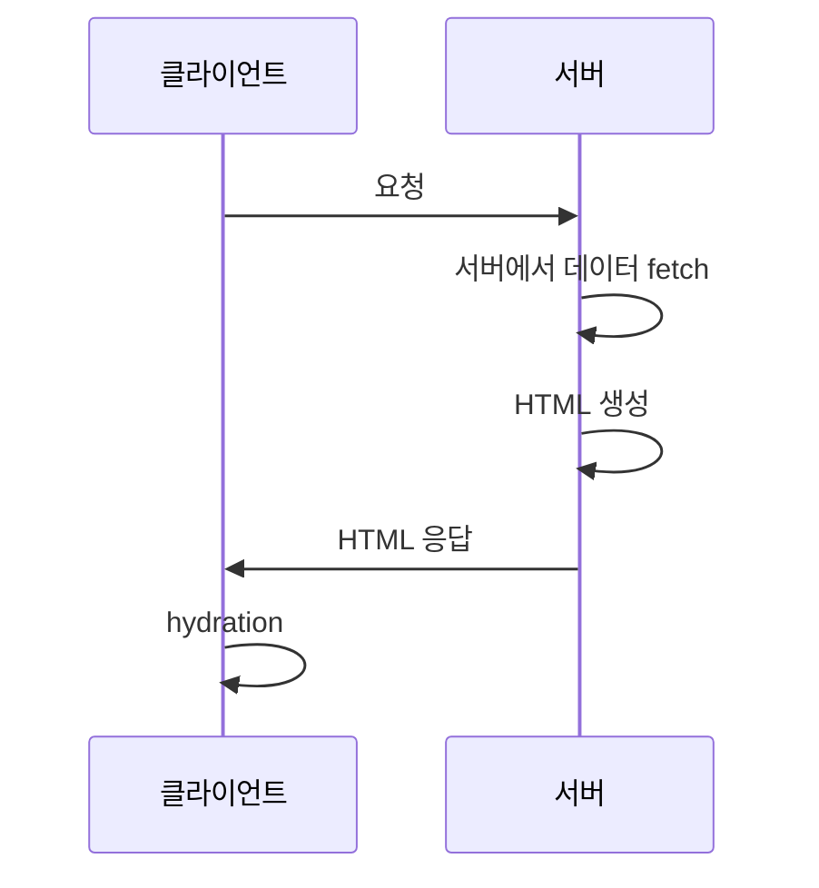

### SSG (Static Site Generation)

**빌드 시점에 정적 HTML을 미리 생성해두는 방식**입니다. Pages Router에서는 `getStaticProps`로 명시했지만, App Router에서는 프레임워크가 동적 의존성이 없는 경우를 자동으로 static 최적화 대상으로 판단합니다.

Static으로 판단되는 조건:

- 요청 시점 의존성 없음 (`cookies()`, `headers()`, `searchParams` 미사용)
- 사용자별 데이터 없음
- `cache: 'no-store'` 미사용

주목할 점은, `fetch`가 포함된 컴포넌트도 기본적으로 static 최적화 대상이 될 수 있다는 것입니다. App Router의 `fetch`는 버전에 따라 기본 캐시 동작이 다를 수 있으므로, 명시적으로 캐시 옵션을 지정하는 것이 더 안전한 관행입니다.

```tsx
// 강제로 static 처리
export const dynamic = 'force-static'
```

> **Q: App Router에서 fetch의 기본 캐시 동작은 무엇인가?**
>
> Next.js 13~14에서는 `fetch`의 기본값이 `force-cache`에 가까웠습니다.
> Next.js 15부터는 기본값이 `no-store`로 변경되었습니다.
> 버전에 따라 동작이 다를 수 있으므로, 캐시 의도를 명시적으로 표현하는 것이 권장됩니다.

### ISR (Incremental Static Regeneration)

**SSG의 확장판으로, 정적 캐시를 주기적으로 재생성하는 방식**입니다. SSR의 상위 호환이 아니라 SSG의 연장선에 있습니다.

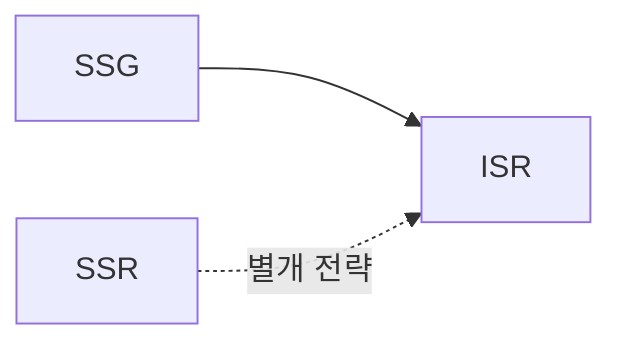

동작 흐름은 다음과 같습니다.

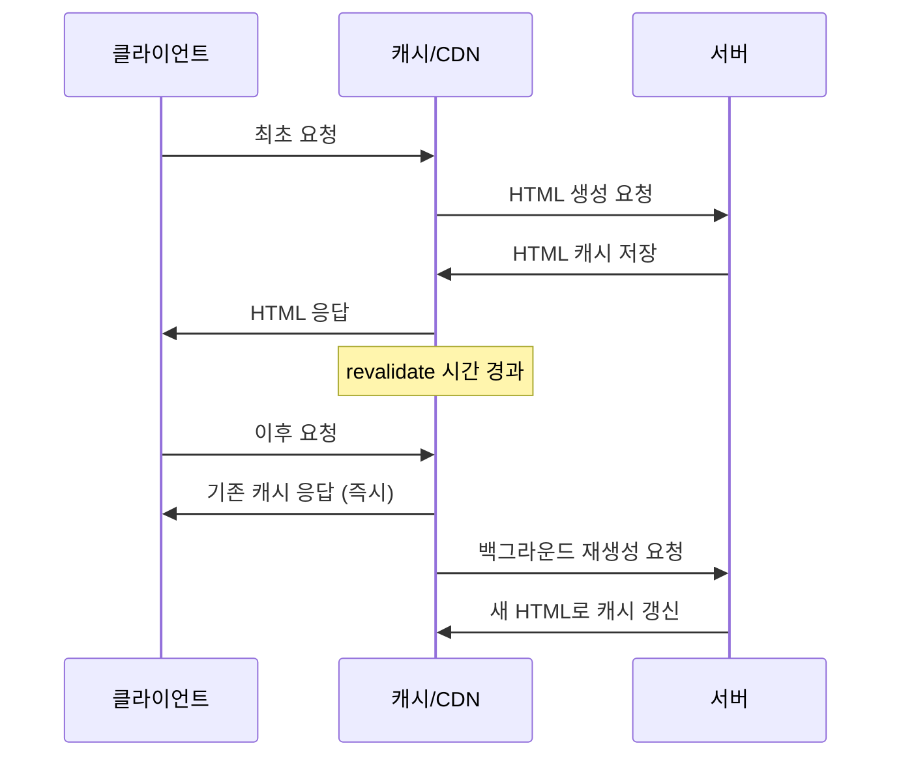

사용자는 재생성을 기다리지 않습니다. 캐시가 만료된 이후에도 우선 기존 캐시를 응답하고, 백그라운드에서 새 HTML을 생성합니다. 이 방식을 **stale-while-revalidate** 패턴이라고 합니다.

```tsx
// Route Segment 수준 설정
export const revalidate = 60 // 60초마다 재생성

// fetch 수준 설정
const data = await fetch(url, {
  next: { revalidate: 60 },
})
```

| 항목 | ISR 적합 | ISR 부적합 |
|------|---------|-----------|
| 사례 | 상품 목록, 뉴스, 블로그, 커뮤니티 게시글 | 사용자별 데이터, 실시간 데이터, 인증 기반 UI |
| 이유 | 변경 주기가 있고 공용 데이터 | 사용자마다 다르거나 즉각 반영 필요 |

### Streaming SSR

**HTML을 한 번에 전송하지 않고, 준비된 부분부터 순차적으로 스트리밍하는 방식**입니다. React의 `Suspense`와 결합하여 동작합니다.

기존 SSR의 문제:

```
모든 fetch 완료 → HTML 생성 → 응답
```

데이터가 느린 컴포넌트가 하나라도 있으면 전체 응답이 지연됩니다.

Streaming SSR의 동작:

```
준비된 UI 즉시 전송 → 나머지 섹션 스트리밍
```

```tsx
import { Suspense } from 'react'

export default function Page() {
  return (
    <div>
      <Header />  {/* 즉시 렌더링 */}
      <Suspense fallback={<Loading />}>
        <HeavySection />  {/* 데이터 준비 후 스트리밍 */}
      </Suspense>
    </div>
  )
}
```

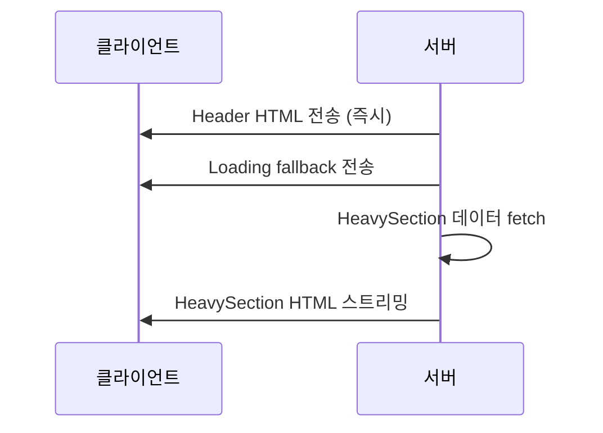

### RSC (React Server Components)

**서버에서만 실행되고, JavaScript 번들에 포함되지 않는 React 컴포넌트**입니다. App Router에서 컴포넌트의 기본값은 Server Component입니다.

```tsx
// Server Component (기본값, 'use client' 없음)
export default async function ProductList() {
  const products = await db.query('SELECT * FROM products')
  return <ul>{products.map(p => <li key={p.id}>{p.name}</li>)}</ul>
}

// Client Component (명시 필요)
'use client'
export function InteractiveButton() {
  const [clicked, setClicked] = useState(false)
  return <button onClick={() => setClicked(true)}>Click</button>
}
```

RSC의 핵심 원칙:

> **Best JavaScript = 보내지 않은 JavaScript**

서버에서 처리할 수 있는 로직은 서버에 두고, 브라우저로 보내는 JavaScript 양을 최소화합니다. 이를 통해 hydration 비용과 번들 크기를 줄입니다.

| 항목 | Server Component | Client Component |
|------|-----------------|-----------------|
| 실행 위치 | 서버 | 브라우저 |
| JS 번들 포함 | 포함되지 않음 | 포함됨 |
| 상태(useState) | 사용 불가 | 사용 가능 |
| 브라우저 API | 사용 불가 | 사용 가능 |
| 데이터 fetch | 직접 가능 | API 호출 필요 |

### Partial Prerendering (PPR)

**정적 영역과 동적 영역을 하나의 페이지에서 혼합하는 전략**입니다. 빌드 시점에 정적 셸(shell)을 생성하고, 동적 부분만 요청 시 스트리밍으로 채웁니다.

```tsx
// 정적 영역: Header
// 동적 영역: UserInfo (사용자별 데이터)
export default function Page() {
  return (
    <>
      <Header />  {/* Static */}
      <Suspense fallback={<Skeleton />}>
        <UserInfo />  {/* Dynamic, 스트리밍 */}
      </Suspense>
    </>
  )
}
```

PPR은 현재(Next.js 15 기준) 실험적 기능(experimental)입니다.

## fetch 캐시 전략

App Router에서 렌더링 전략은 페이지 단위보다 **fetch 수준의 캐시 설정**이 중심이 됩니다.

### 캐시 옵션별 동작

| fetch 설정 | 동작 | 렌더링 결과 |
|-----------|------|-----------|
| `fetch(url)` | 버전에 따라 다름, 명시 권장 | 버전 의존적 |
| `fetch(url, { cache: 'force-cache' })` | 빌드/최초 요청 캐시 유지 | Static / SSG |
| `fetch(url, { next: { revalidate: N } })` | N초마다 재생성 | ISR |
| `fetch(url, { cache: 'no-store' })` | 캐시 없음, 매 요청 실행 | SSR |

```tsx
// Static (SSG)
const staticData = await fetch(url, { cache: 'force-cache' })

// ISR
const isrData = await fetch(url, {
  next: { revalidate: 3600 }, // 1시간마다 재생성
})

// SSR
const dynamicData = await fetch(url, { cache: 'no-store' })
```

하나의 페이지에서 데이터 변경 주기에 따라 다른 전략을 적용할 수 있습니다.

```tsx
export default async function ProductPage() {
  // 상품 정보: 자주 바뀌지 않음 → ISR
  const product = await fetch(productUrl, {
    next: { revalidate: 3600 },
  })

  // 재고: 실시간 반영 필요 → SSR
  const stock = await fetch(stockUrl, { cache: 'no-store' })

  return <ProductView product={await product.json()} stock={await stock.json()} />
}
```

### Route Segment 설정

페이지 또는 레이아웃 파일에서 세그먼트 전체의 동작을 설정할 수 있습니다.

```tsx
// 전체 세그먼트를 강제로 SSR
export const dynamic = 'force-dynamic'

// 전체 세그먼트를 강제로 Static
export const dynamic = 'force-static'

// 세그먼트 수준 revalidate
export const revalidate = 60
```

> **Q: 레이아웃은 자동으로 ISR이 되는가?**
>
> 레이아웃이 자동으로 ISR이 되는 것은 아닙니다.
> Header, Sidebar, Footer처럼 자주 변경되지 않는 구조이기 때문에 static 캐싱에 적합한 경향이 있을 뿐입니다.
> ISR이 되려면 `export const revalidate = N` 또는 fetch 수준의 `next.revalidate` 설정이 필요합니다.

## 실무 조합 패턴

### 일반적인 계층별 전략

실무에서는 페이지의 각 영역을 데이터 특성에 맞는 전략으로 조합합니다.

| 영역 | 전략 | 이유 |
|------|------|------|
| 레이아웃 (Header, Footer) | SSG / ISR | 변경 빈도 낮음, 공용 데이터 |
| 상품 목록 / 뉴스 | ISR | 주기적 업데이트, 공용 데이터 |
| 유저 정보 / 인증 UI | SSR | 사용자별 데이터 |
| 필터 상태 / 수량 조작 | CSR | 인터랙션 중심 |
| 무거운 섹션 | Streaming SSR | 느린 fetch, 분리 가능 |

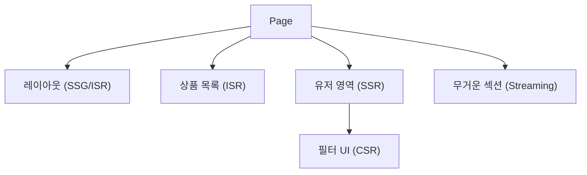

### ViewModel 패턴과의 결합

서버에서 fetch한 데이터를 도메인 매퍼를 통해 ViewModel로 변환하고, 각 섹션에 적합한 전략을 적용하는 구조입니다.

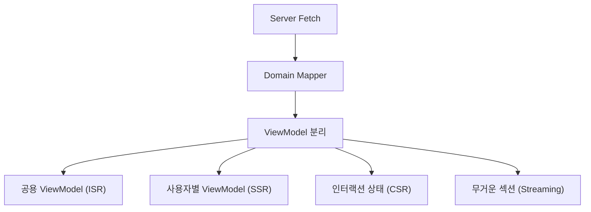

```tsx
// app/products/[id]/page.tsx
export default async function ProductPage({ params }) {
  // 공용 데이터: ISR
  const productRes = await fetch(`/api/products/${params.id}`, {
    next: { revalidate: 3600 },
  })
  // 실시간 데이터: SSR
  const stockRes = await fetch(`/api/stock/${params.id}`, {
    cache: 'no-store',
  })

  const product = toProductViewModel(await productRes.json())
  const stock = await stockRes.json()

  return (
    <div>
      <ProductInfo product={product} />
      <StockBadge stock={stock} />
      <Suspense fallback={<ReviewSkeleton />}>
        <ReviewSection productId={params.id} />
      </Suspense>
      <CartButton productId={params.id} />  {/* Client Component */}
    </div>
  )
}
```

이 구조의 장점:

- API 구조와 UI 구조를 분리할 수 있습니다
- 데이터별로 캐시 전략을 세분화할 수 있습니다
- hydration 범위를 최소화할 수 있습니다
- 유지보수 시 변경 범위가 좁아집니다

### 대규모 트래픽 전략

대규모 트래픽 환경에서의 핵심 원칙은 **서버를 매 요청마다 실행하지 않는 것**입니다.

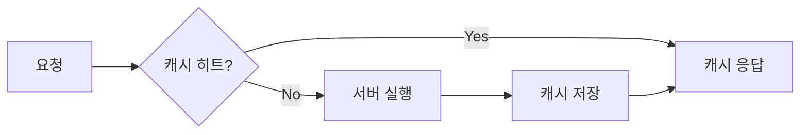

권장 구조:

- **공용 데이터** → ISR (캐시 최대 활용)
- **유저 데이터** → CSR 또는 SSR (필요한 경우만 서버 실행)
- **느린 섹션** → Streaming (전체 응답을 블로킹하지 않음)

피해야 할 패턴:

```tsx
// 페이지 전체를 no-store로 설정하면 매 요청마다 서버가 실행됨
// 대규모 트래픽 환경에서 서버 비용 급증
export const dynamic = 'force-dynamic'
```

## 번들러 비교

Next.js의 렌더링·캐시 전략을 이해한 뒤에는, 그 동작을 지원하는 번들러의 역할을 살펴볼 필요가 있습니다.

### Webpack

**엔트리 포인트부터 전체 의존성 그래프를 분석하고, 최적화된 청크를 생성하는 범용 번들러**입니다.

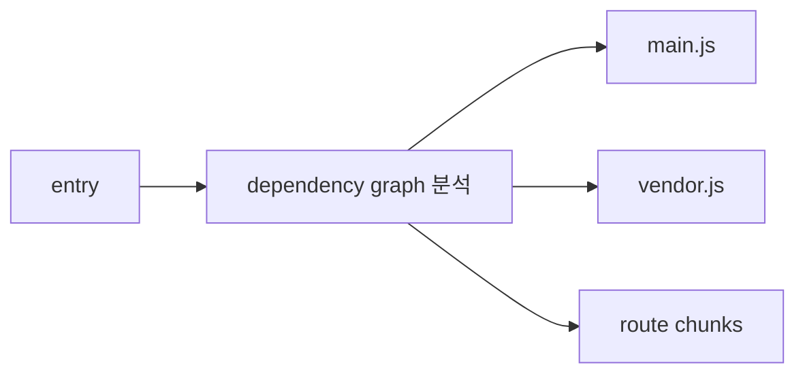

특징:

- 전체 앱 관점에서 최적화합니다
- 플러그인 생태계가 매우 풍부합니다
- 프로덕션 빌드 안정성이 높습니다
- 대규모 앱에서 개발 서버의 재빌드 속도가 느려질 수 있습니다

### Vite

**개발 중에는 번들링하지 않고, Native ESM 기반으로 요청된 모듈만 변환(transform)하는 방식**입니다.

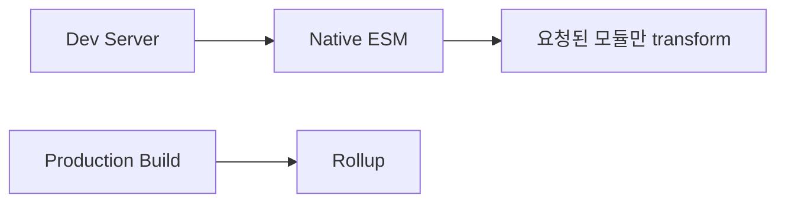

핵심 철학: **"개발 중엔 번들링하지 말자"**

| 환경 | 방식 |
|------|------|
| 개발 | Native ESM, 요청된 모듈만 변환 |
| 프로덕션 | Rollup 기반 빌드 |

개발 서버 시작 속도와 HMR(Hot Module Replacement) 속도가 빠르기 때문에 DX(Developer Experience)가 우수합니다.

### Turbopack

**Rust로 작성된 증분 계산(Incremental Computation) 기반 번들러**로, Next.js에 최적화되어 있습니다.

핵심 철학: **"변경된 부분만 재계산한다"**

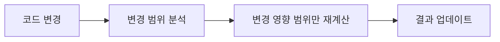

| 환경 | 상태 (Next.js 15 기준) |
|------|----------------------|
| 개발 서버 | 안정화됨 |
| 프로덕션 빌드 | 실험적 단계 |

개발 목표는 최소 계산(빠른 피드백), 프로덕션 목표는 최대 최적화입니다.

### 세 번들러 비교표

| 항목 | Webpack | Vite | Turbopack |
|------|---------|------|-----------|
| 구현 언어 | JavaScript | JavaScript | Rust |
| 핵심 철학 | 범용 플랫폼 | 빠른 DX | 증분 계산 |
| Dev 시작 속도 | 보통~느림 | 매우 빠름 | 매우 빠름 |
| HMR 속도 | 보통 | 매우 빠름 | 매우 빠름 |
| 프로덕션 빌드 안정성 | 매우 높음 | 높음 | 발전 중 |
| Next.js 최적화 | 기본 지원 | 공식 미지원 | 전용 설계 |
| 특징 | 의존성 그래프 중심 | Native ESM | 증분 그래프 |

> **Q: 번들러가 다르면 최종 사용자 성능도 크게 달라지는가?**
>
> 프로덕션 기준으로 Webpack과 Vite의 최종 사용자 체감 성능 차이는 개발 경험만큼 크지 않은 경우가 많습니다.
> 실제 사용자 성능에 더 큰 영향을 주는 요소는 번들러 선택보다 다음 항목들입니다.
>
> - hydration 범위 (RSC 활용 여부)
> - JavaScript 번들 크기
> - 캐시 전략 (ISR, CDN 활용)
> - Streaming 적용 여부
>
> "Best JavaScript = 보내지 않은 JavaScript"라는 관점이 번들러 선택보다 우선합니다.

## Next.js와 번들러 통합 구조

Next.js에서 Vite를 사용하기 어려운 이유는 Next.js가 단순한 React 앱이 아니기 때문입니다.

Next.js는 번들러와 강하게 결합된 기능들을 포함합니다.

- RSC(React Server Components) 변환
- 클라이언트/서버 코드 분리
- Streaming 처리
- Route graph 최적화
- Edge runtime 지원

이 기능들은 빌드 파이프라인 수준에서 번들러와 통합되어 있습니다. 따라서 Next.js는 현재 **Framework Runtime + Bundler**가 결합된 구조로 동작합니다.

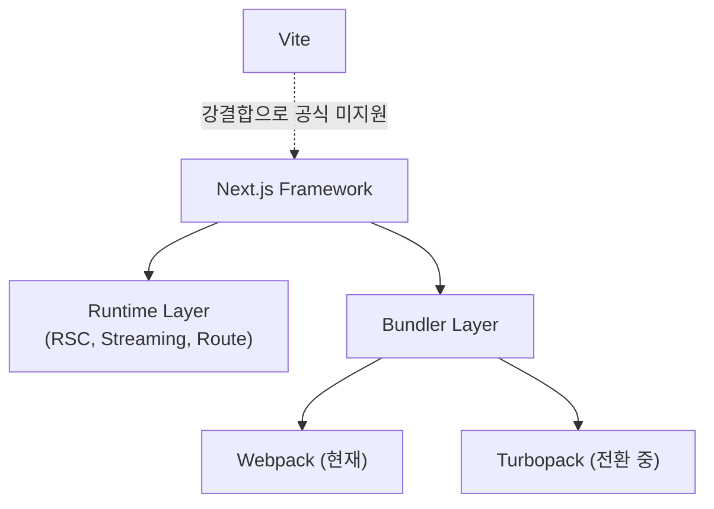

현재 방향은 Webpack에서 Turbopack으로의 전환입니다. Turbopack은 Next.js 팀이 주도하여 Next.js의 내부 구조에 맞게 설계되었기 때문입니다.

## 요약

- App Router에서 Next.js의 본질은 SSR 프레임워크가 아니라 **캐시·렌더링 오케스트레이션 프레임워크**입니다.
- 핵심 질문은 "무엇을 캐시하고, 언제 재생성하며, 어디까지 hydration할 것인가"입니다.
- **CSR**: 브라우저 인터랙션 중심. 페이지 전체가 아닌 인터랙션 영역에만 적용하는 것이 일반적입니다.
- **SSR**: 요청마다 서버 실행. `cache: 'no-store'` 또는 `force-dynamic`으로 활성화합니다.
- **SSG**: 빌드 시점 정적 생성. App Router에서 프레임워크가 자동 추론합니다.
- **ISR**: SSG의 확장. `revalidate` 설정으로 주기적 재생성. stale-while-revalidate 패턴으로 사용자 대기 없음.
- **Streaming SSR**: `Suspense`로 준비된 영역부터 순차 전송. 느린 섹션 분리에 효과적입니다.
- **RSC**: 서버에서만 실행, JS 번들 미포함. "보내지 않은 JavaScript가 최선"입니다.
- **PPR**: 정적 셸 + 동적 Streaming 혼합. 현재 실험적 기능입니다.
- 실무 전략: Static 우선 → 필요한 부분만 Dynamic → 사용자 상태만 CSR → 무거운 부분만 Streaming.
- **Webpack**: 범용 의존성 그래프 번들러. 프로덕션 안정성 높음.
- **Vite**: Native ESM 기반. 개발 경험 우수. Next.js 공식 미지원.
- **Turbopack**: Rust 기반 증분 계산. Next.js 전용 설계. 개발 서버 안정화, 빌드는 발전 중.
- 최종 사용자 성능은 번들러 선택보다 hydration 범위, 번들 크기, 캐시 전략의 영향이 더 큰 경우가 많습니다.
