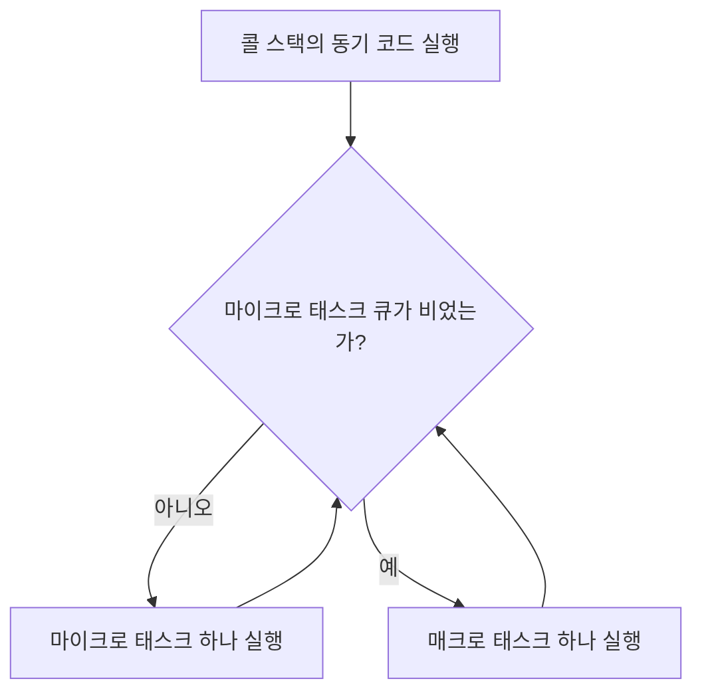

# JavaScript 이벤트 루프의 작업 단위: 매크로 태스크와 마이크로 태스크

> 한줄 정의: 이벤트 루프는 **매크로 태스크**와 **마이크로 태스크**라는 두 종류의 작업 큐를 운영하며, 마이크로 태스크가 항상 먼저 소진된 뒤 매크로 태스크가 하나씩 처리된다.

## 목차

- [개요](#개요)
- [매크로 태스크와 마이크로 태스크](#매크로-태스크와-마이크로-태스크)
- [이벤트 루프의 실행 순서](#이벤트-루프의-실행-순서)
- [async/await의 동작 방식](#asyncawait의-동작-방식)
- [흔한 함정과 디버깅](#흔한-함정과-디버깅)
- [Node.js 환경의 차이점](#nodejs-환경의-차이점)
- [실무 활용](#실무-활용)
- [요약](#요약)

## 개요

다음 코드의 출력 순서를 예측해 보자.

```javascript
console.log('시작');
setTimeout(() => console.log('setTimeout'), 0);
Promise.resolve().then(() => console.log('Promise'));
console.log('끝');
```

`setTimeout`의 딜레이가 0이므로 곧바로 실행될 것 같지만, 실제 출력은 다음과 같다.

```
시작
끝
Promise
setTimeout
```

Promise 콜백이 setTimeout 콜백보다 먼저 실행된다. 이 동작을 이해하려면 이벤트 루프가 관리하는 두 가지 작업 큐, **매크로 태스크(Macro Task)**와 **마이크로 태스크(Micro Task)**의 차이를 알아야 한다.

## 매크로 태스크와 마이크로 태스크

### 매크로 태스크 (Macro Task)

브라우저나 Node.js 같은 호스트 환경이 제공하는 비동기 API가 생성하는 작업이다. 이벤트 루프가 한 번 순회할 때 **하나씩** 꺼내서 처리한다.

| API | 환경 |
|-----|------|
| `setTimeout` / `setInterval` | 브라우저, Node.js |
| `setImmediate` | Node.js |
| I/O 작업 (파일 읽기, 네트워크 요청) | Node.js |
| UI 이벤트 (click, scroll 등) | 브라우저 |
| `MessageChannel` / `postMessage` | 브라우저 |

### 마이크로 태스크 (Micro Task)

JavaScript 엔진 자체에서 생성하는 작업이다. 매크로 태스크보다 우선순위가 높으며, 현재 실행 중인 코드가 끝나면 **큐가 완전히 빌 때까지** 연속 처리된다.

| API | 환경 |
|-----|------|
| `Promise.then()` / `.catch()` / `.finally()` | 공통 |
| `async/await` (await 이후 코드) | 공통 |
| `queueMicrotask()` | 공통 |
| `MutationObserver` | 브라우저 |
| `process.nextTick` | Node.js (최고 우선순위) |

> **Q: `queueMicrotask()`는 `Promise.resolve().then()`과 무엇이 다른가?**
> 동작 타이밍은 동일하지만 `queueMicrotask()`는 Promise 객체를 생성하지 않으므로 오버헤드가 적다. 마이크로 태스크를 직접 등록할 목적이라면 `queueMicrotask()`가 더 적합하다.

## 이벤트 루프의 실행 순서

이벤트 루프는 다음 사이클을 반복한다.



정리하면 다음 순서다.

1. **콜 스택의 동기 코드**를 모두 실행한다.
2. **마이크로 태스크 큐**가 빌 때까지 전부 처리한다.
3. **매크로 태스크**를 하나 꺼내 실행한다.
4. 다시 2번으로 돌아간다.

```
동기 코드 → 모든 마이크로 태스크 → 매크로 태스크 1개 → 모든 마이크로 태스크 → …
```

### 기본 예제

```javascript
console.log('1');                                    // 동기
setTimeout(() => console.log('2'), 0);               // 매크로
Promise.resolve().then(() => console.log('3'));       // 마이크로
console.log('4');                                    // 동기
```

실행 과정은 다음과 같다.

1. `console.log('1')` 실행 → 출력: `1`
2. `setTimeout` 콜백이 매크로 태스크 큐에 등록
3. `Promise.then` 콜백이 마이크로 태스크 큐에 등록
4. `console.log('4')` 실행 → 출력: `4`
5. 동기 코드 완료. 마이크로 태스크 처리 → 출력: `3`
6. 매크로 태스크 처리 → 출력: `2`

최종 출력: `1` → `4` → `3` → `2`

### 매크로 태스크 안에서 마이크로 태스크가 생성되는 경우

```javascript
console.log('시작');

setTimeout(() => {
  console.log('매크로 1');
  Promise.resolve().then(() => console.log('매크로 1 안의 마이크로'));
}, 0);

setTimeout(() => console.log('매크로 2'), 0);

Promise.resolve().then(() => {
  console.log('마이크로 1');
  return Promise.resolve();
}).then(() => console.log('마이크로 2'));

console.log('끝');
```

실행 과정을 단계별로 추적해 보자.

1. `시작` 출력 (동기)
2. 첫 번째 `setTimeout` 콜백 → 매크로 큐에 등록
3. 두 번째 `setTimeout` 콜백 → 매크로 큐에 등록
4. `Promise.then` 체인 → 마이크로 큐에 등록
5. `끝` 출력 (동기)
6. 마이크로 태스크 전부 처리 → `마이크로 1`, `마이크로 2` 출력
7. 매크로 태스크 하나 처리 → `매크로 1` 출력. 내부에서 새 마이크로 태스크 생성
8. 방금 생성된 마이크로 태스크 처리 → `매크로 1 안의 마이크로` 출력
9. 매크로 태스크 하나 처리 → `매크로 2` 출력

```
시작
끝
마이크로 1
마이크로 2
매크로 1
매크로 1 안의 마이크로
매크로 2
```

핵심은 7~8단계다. 매크로 태스크 실행 도중에 생성된 마이크로 태스크는, 다음 매크로 태스크로 넘어가기 전에 먼저 소진된다.

## async/await의 동작 방식

`async/await`는 Promise 기반 문법이므로 `await` 이후의 코드는 마이크로 태스크로 처리된다.

```javascript
async function test() {
  console.log('async 함수 시작');       // 동기
  await Promise.resolve();
  console.log('await 이후');            // 마이크로
  setTimeout(() => console.log('async 안의 setTimeout'), 0);
}

console.log('1');
test();
console.log('2');
setTimeout(() => console.log('외부 setTimeout'), 0);
```

```
1
async 함수 시작
2
await 이후
외부 setTimeout
async 안의 setTimeout
```

`await` 키워드를 만나면 함수 실행이 일시 중단되고, `await` 이후 코드가 마이크로 태스크 큐에 등록된다. 따라서 `console.log('2')`가 먼저 실행되고, 이어서 마이크로 태스크인 `await 이후`가 실행된다.

> **Q: `await`는 내부적으로 어떻게 변환되는가?**
> `await expr` 이후의 코드는 `Promise.resolve(expr).then(이후코드)`와 동등하게 변환된다. 결국 `.then()` 콜백과 같은 마이크로 태스크 타이밍에 실행되는 것이다.

## 흔한 함정과 디버깅

### 무한 마이크로 태스크

```javascript
function infiniteMicrotask() {
  Promise.resolve().then(() => {
    console.log('마이크로 태스크 실행');
    infiniteMicrotask();
  });
}

setTimeout(() => console.log('이 코드는 실행되지 않는다'), 0);
infiniteMicrotask();
```

마이크로 태스크 큐가 빌 때까지 매크로 태스크로 넘어가지 않기 때문에, 마이크로 태스크가 자기 자신을 계속 등록하면 매크로 태스크는 영원히 실행되지 않는다. 브라우저 탭이 멈춘 것처럼 보이게 된다.

### Promise 체인에서 추가 틱이 발생하는 경우

```javascript
Promise.resolve()
  .then(() => {
    console.log('첫 번째 then');
    return Promise.resolve();       // Promise를 반환
  })
  .then(() => console.log('두 번째 then'));

Promise.resolve()
  .then(() => console.log('다른 Promise의 then'));
```

```
첫 번째 then
다른 Promise의 then
두 번째 then
```

`.then()` 안에서 `Promise.resolve()`를 반환하면 추가 마이크로 태스크 틱이 필요하다. 그 사이에 다른 마이크로 태스크가 먼저 실행될 수 있으므로 주의해야 한다.

> **Q: 왜 Promise를 반환하면 추가 틱이 생기는가?**
> `.then()`이 Promise를 반환하면 해당 Promise의 resolve를 기다리기 위해 내부적으로 추가 `.then()` 호출이 발생한다. 이 과정에서 마이크로 태스크가 한 번 더 큐에 등록되어 실행 순서가 밀리게 된다.

### 실행 순서 분석 절차

복잡한 비동기 코드를 분석할 때 다음 순서로 추적하면 정확도를 높일 수 있다.

1. 동기 코드를 위에서 아래로 나열한다.
2. 각 비동기 API가 어느 큐에 등록되는지 분류한다 (매크로 / 마이크로).
3. 동기 코드 완료 후 마이크로 태스크 큐를 전부 소진한다.
4. 매크로 태스크를 하나 실행한 뒤, 다시 마이크로 태스크 큐를 확인한다.
5. 매크로 태스크 실행 중 새로 등록된 비동기 작업이 있으면 해당 큐에 추가한다.

## Node.js 환경의 차이점

Node.js에는 `process.nextTick`이라는 별도의 마이크로 태스크가 존재한다. 일반 마이크로 태스크(Promise)보다 우선순위가 높다.

```javascript
setTimeout(() => console.log('setTimeout'), 0);
setImmediate(() => console.log('setImmediate'));
process.nextTick(() => console.log('nextTick'));
Promise.resolve().then(() => console.log('Promise'));
```

```
nextTick
Promise
setTimeout
setImmediate
```

Node.js의 마이크로 태스크 우선순위는 `process.nextTick` > `Promise` 순서다. `setImmediate`는 이벤트 루프의 check 페이즈에서 실행되므로 `setTimeout`보다 뒤에 올 수도, 앞에 올 수도 있다 (타이머 해상도에 따라 달라진다).

> **Q: `setImmediate`와 `setTimeout(fn, 0)`의 순서가 불확정적인 이유는?**
> `setTimeout(fn, 0)`은 실제로 최소 1ms의 딜레이를 가진다. 이벤트 루프 진입 시점에 1ms가 이미 경과했으면 timer 페이즈에서 `setTimeout`이 먼저 실행되고, 아직 경과하지 않았으면 check 페이즈의 `setImmediate`가 먼저 실행된다.

## 실무 활용

### 작업 우선순위 분리

사용자 인터랙션 핸들러에서 중요한 상태 업데이트와 무거운 후처리를 분리할 수 있다.

```javascript
button.addEventListener('click', () => {
  // 즉시 반영해야 하는 상태 업데이트 → 마이크로 태스크
  queueMicrotask(() => {
    updateCriticalState();
    renderUI();
  });

  // 무거운 연산 → 매크로 태스크로 지연
  setTimeout(() => {
    performHeavyCalculation();
  }, 0);
});
```

### 비동기 테스트에서 실행 순서 제어

```javascript
test('마이크로 태스크가 매크로 태스크보다 먼저 실행된다', async () => {
  const results = [];

  setTimeout(() => results.push('macro'), 0);
  Promise.resolve().then(() => results.push('micro'));

  // 마이크로 태스크 완료 대기
  await Promise.resolve();
  expect(results).toEqual(['micro']);

  // 매크로 태스크 완료 대기
  await new Promise(resolve => setTimeout(resolve, 0));
  expect(results).toEqual(['micro', 'macro']);
});
```

## 요약

- 이벤트 루프는 **매크로 태스크 큐**와 **마이크로 태스크 큐**, 두 가지 작업 큐를 운영한다.
- 실행 순서: **동기 코드 → 마이크로 태스크 전부 → 매크로 태스크 1개 → 마이크로 태스크 전부 → 반복**
- `Promise.then`, `async/await`, `queueMicrotask`는 마이크로 태스크다.
- `setTimeout`, `setInterval`, I/O, UI 이벤트는 매크로 태스크다.
- 매크로 태스크 실행 중 생성된 마이크로 태스크는 다음 매크로 태스크 전에 소진된다.
- Node.js의 `process.nextTick`은 일반 마이크로 태스크보다 우선순위가 높다.
- `.then()` 내부에서 Promise를 반환하면 추가 틱이 발생하여 실행 순서가 밀릴 수 있다.
