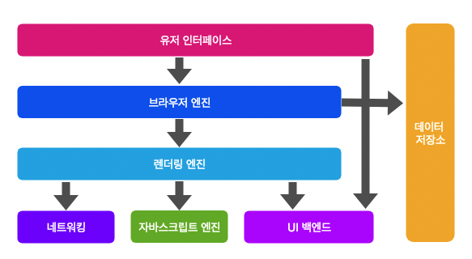
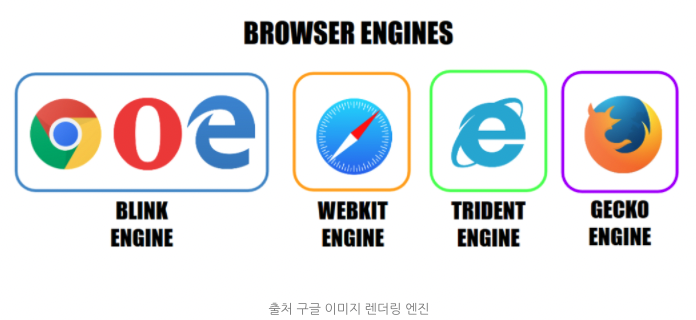
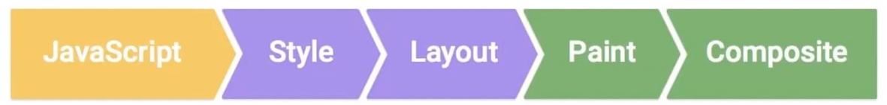

## 웹 브라우저의 구조



- 유저 인터페이스
  - 주소 표시줄, 뒤/앞으로가기, 북마크 등 브라우저의 사용자 UI.
  - 요청한 페이지를 보여주는 렌더링 페이지를 제외한 나머지 부분.
- 브라우저 엔진
  - 유저 인터페이스와 렌더링 엔진 사이의 동작을 제어
- **렌더링 엔진**
  - 요청한 웹페이지의 콘텐츠를 표시.
  - HTML과 CSS를 파싱하여 화면에 보여줌.
- 네트워킹
  - XHR(http, file, ftp 등) 요청과 같은 네트워크 호출에 사용.
  - 플랫폼 독립적인 인터페이스이고 각 플랫폼 하부에서 실행
- 자바스크립트 엔진
  - 자바스크립트 코드를 실행하는 인터프리터
  - 크롬의 경우 V8
- UI 백엔드
  - 콤보박스, 체크박스 및 윈도우와 같은 핵심 위젯을 그림.
  - 플랫폼에서 명시하지 않은 일반적인 인터페이스로써 OS 사용자 인터페이스 체계를 사용한다.
- 데이터 저장소
  - 웹에서 데이터를 하드디스크에 저장한다.
  - 저장소는 대표적으로 localStorage, SessionStorage, 쿠키

## 브라우저마다 다른 렌더링 엔진



## 렌더링 엔진의 동작 과정(Critical Rendering Path)

> 대표적인 크롬의 Blink를 기준으로 설명.



브라우저는 `파싱` ->  `스타일` -> `레이아웃` -> `페인트` -> `합성` -> `렌더`등의 과정을 거친다. 그 후에 JS나 CSS를 통해 DOM이나 CSS에 변화가 생길 경우 reflow/ repaint 등의 과정을 수행한다.

### 1. 파싱

#### DOM Tree 생성

HTML을 파싱하여 루트가 Document인 DOM 객체 트리를 구성한다.

```html
<!DOCTYPE html>
<html>
  <head>
    <meta name="viewport" content="width=device-width,initial-scale=1">
    <link href="style.css" rel="stylesheet">
    <title>Critical Path</title>
  </head>
  <body>
    <p>Hello <span>web performance</span> students!</p>
    <div></div>
  </body>
</html>
```


#### CSSOM Tree 생성

CSS를 파싱하여 CSSOM을 트리를 구성한다.


body, p, span 등 선택자가 노드로 생성되고 각 노드는 스타일을 참조

### 2. 스타일


#### Render Tree 생성

DOM tree,, CSSOM Tree가 생성되면 스타일을 매칭시켜주는 과정을 거쳐 렌더 트리를 구성한다.  
렌더링 트리에는 **페이지를 렌더링하는데 필요한 노드만 포함**된다.

- DOM Tree생성 + CSSOM Tree 생성
- 화면에 표시되어야 할 모든 노드의 컨텐츠, 스타일 정보를 포함하는 트리

### 3. 레이아웃

Render Tree 배치, _Layout_(Reflow)

- 뷰포트 내에서 요소들에 정확한 위치와 크기를 계산하는 과정


### 4. 페인트

Render Tree 그리기, _Paint_(Repaint)

- 렌더링 트리의 각 노드를 화면의 실제 픽셀로 변환하는 마지막 단계


- 레이아웃이 완료될 때 브라우저가 'Paint Setup' 및 'Paint' 이벤트를 발생
- 렌더링 트리를 화면의 픽셀로 변환

### 5. 합성(Compositing)

화면에 표시하기 위해 페이지에서 페인트된 부분을 합치는 과정


## 렌더링 최적화

위 **Critical Render Path** 시간을 줄이면 브라우저가 웹 페이지를 보여주는 시간을 줄일수있다.

_<https://csstriggers.com> 해당 링크를 통해 CSS가 렌더링시 어떤 동작이 발생하는지 확인가능하고 이를 잘 활용한다면 최적화가 가능하다._

### 다시 Layout이 발생하는 경우

주로 요소의 크기나 위치가 바뀔때, 혹은 브라우저 창의 크기가 바뀔때 다시 발생

### Paint부터 다시 발생되는 경우

주로 배경 이미지나 텍스트 생삭, 그림자 등 Layout의 수치를 변화시키지 않는 스타일의 변경이 일어났을때 발생

### 레이어의 합성(Composite)만 다시 발생하는 경우

레이어는 페인팅할 영역을 나누어 놓은 것을 의미. 크롬의 경우 Render tree의 노드를 영역을 나누워 관리하고 각각 페인팅한 후 하나의 비트맵으로 합성하여 페이지를 완성한다.

레이어의 합성만 이뤄지므로 reflow와 repaint 과정이 발생하지 성능상 큰이점이있음.

> **Google의 리플로우를 최소화하는데 도움이되는 간단한 가이드라인**
>
> - 불필요한 DOM Tree 깊이를 줄인다. DOM tree의 하위 노드를 변경하면 트리의 모든 수준, 즉 위로는 루트, 아래로는 수정된 노드의 하위 요소에 이르기까지 모두 변경될 수 있다. 이에따라 리플로우를 실행하는데 더 많은 시간이 걸린다.
> - CSS 규칙을 최소화하고 사용되지 않는 CSS규칙을 삭제한다.
> - 애니메이션과 같이 복잡한 렌더링을 변경하는 경우 흐름 밖에서 변경한다. 변경할 때는 절대위치나 고정위치를 사용한다.
> - 불필요하고 복잡한 CSS 선택기, 특히 하위 요소 선택기는 사용하지 않는다. 이 경우 선택기를 일치시키기 위해 더 높은 CPU 처리량이 필요하다.

---

참고

- <https://www.youtube.com/watch?v=sJ14cWjrNis>  
- <https://yoonjaepark.github.io/2018-12-25/repaint-reflow>
- <https://velog.io/@hanminss/%EB%B8%8C%EB%9D%BC%EC%9A%B0%EC%A0%80%EC%9D%98-%EB%A0%8C%EB%8D%94%EB%A7%81-%EA%B3%BC%EC%A0%95>
- <https://junilhwang.github.io/TIL/Javascript/Design/Vanilla-JS-Virtual-DOM/#vanilla-javascript%E1%84%85%E1%85%A9-%E1%84%80%E1%85%A1%E1%84%89%E1%85%A1%E1%86%BC%E1%84%83%E1%85%A9%E1%86%B7-virtualdom-%E1%84%86%E1%85%A1%E1%86%AB%E1%84%83%E1%85%B3%E1%86%AF%E1%84%80%E1%85%B5>